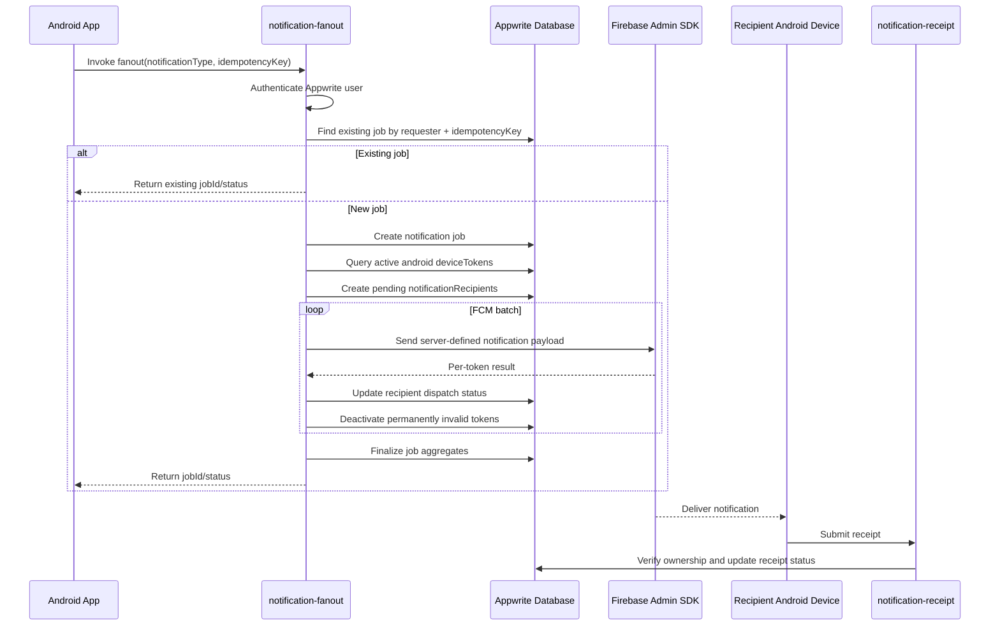

# Checklist: Appwrite Functions Setup And Fanout Algorithm

Source documents required:

- [ ] Read `Project_details/database_defined_push_notification_prd.md`, especially sections 3.4, 6, 8.27 through 8.34, 10, 11, 12, 15, 16, 18, 19, 20.2, 20.4, and 21.
- [ ] Read `Project_details/push_notification_plantuml_diagrams.md`, especially notification fanout, recipient processing, receipt confirmation, and token rotation.
- [ ] Before handoff, verify every function still follows the plan in `Project_details/`.

Owner decisions:

- [ ] Keep Appwrite Function source in this repo under `functions/`.
- [ ] Implement fanout in `functions/notification-fanout`.
- [ ] Keep client device-token upsert direct to Appwrite Database with strict document permissions.
- [ ] Support Android only for this pass.

## Function-Level Flow



## Setup Tasks

This section is written for a first-time Appwrite Functions setup. Follow it in order before starting the fanout algorithm tasks.

Reference docs:

- Appwrite Functions overview: https://appwrite.io/docs/products/functions/functions
- Appwrite Functions quick start: https://appwrite.io/docs/products/functions/quick-start
- Appwrite deploy from Git: https://appwrite.io/docs/products/functions/deploy-from-git
- Appwrite manual/CLI deployment: https://appwrite.io/docs/products/functions/deploy-manually
- Appwrite function environment variables: https://appwrite.io/docs/products/functions/environment-variables
- Appwrite function development and scopes: https://appwrite.io/docs/products/functions/develop

### First-Time Mental Model

- [ ] Understand that the React Native Android app is the client. It signs the user in, registers only that user's Android FCM token, calls Appwrite Functions, and listens for job/receipt updates.
- [ ] Understand that Appwrite Functions are backend code. They run on Appwrite servers, not on the phone, and they are the only code allowed to read all eligible device tokens or call Firebase Admin.
- [ ] Understand that Appwrite Database stores the durable state: users, Android device tokens, notification jobs, notification recipients, and notification receipts.
- [ ] Understand that GitHub stores source code, not secrets. Function code belongs in GitHub; Firebase private keys and Appwrite server API keys belong in Appwrite Function variables.
- [ ] Understand that Firebase Console creates the Android FCM app and service account credentials. The Android app uses `google-services.json`; Appwrite Functions use Firebase Admin variables.

### Recommended First-Time Order

- [ ] Step 1: Create or confirm the GitHub repository.
- [ ] Step 2: Create the `functions/` folder structure locally.
- [ ] Step 3: Commit and push the starter function folders to GitHub.
- [ ] Step 4: Create the Appwrite project, database, collections, and API key in Appwrite Console.
- [ ] Step 5: Create the Firebase Android app and service account in Firebase Console.
- [ ] Step 6: Create Appwrite Functions in Appwrite Console and connect them to the GitHub repo.
- [ ] Step 7: Add function variables in Appwrite Console.
- [ ] Step 8: Push a commit and confirm Appwrite builds/deploys from GitHub.
- [ ] Step 9: Execute `notification-send-validation` from the Appwrite Console before sending any FCM message.
- [ ] Step 10: Test receive validation and fanout only after Android device token registration works.

### Repo Folder Layout To Create

Create this structure before wiring the Console deployment paths:

```text
functions/
  shared/
    appwriteAdmin.ts
    config.ts
    firebaseAdmin.ts
    http.ts
    notifications.ts
  notification-send-validation/
    package.json
    tsconfig.json
    README.md
    src/
      main.ts
  notification-receive-validation/
    package.json
    tsconfig.json
    README.md
    src/
      main.ts
  notification-fanout/
    package.json
    tsconfig.json
    README.md
    src/
      main.ts
  notification-receipt/
    package.json
    tsconfig.json
    README.md
    src/
      main.ts
```

### Local Commands To Run

Run these from the repo root unless the step says otherwise:

```powershell
New-Item -ItemType Directory -Force functions
New-Item -ItemType Directory -Force functions\shared
New-Item -ItemType Directory -Force functions\notification-fanout\src
New-Item -ItemType Directory -Force functions\notification-send-validation\src
New-Item -ItemType Directory -Force functions\notification-receive-validation\src
New-Item -ItemType Directory -Force functions\notification-receipt\src
```

After each function gets its own `package.json`, install dependencies from that function folder:

```powershell
Set-Location functions\notification-fanout
npm install firebase-admin node-appwrite
npm install --save-dev typescript @types/node
npm run typecheck
npm run build
Set-Location ..\..
```

Repeat the dependency install/build check for `notification-send-validation`, `notification-receive-validation`, and `notification-receipt`. `notification-receipt` may not need `firebase-admin` unless it later sends FCM messages.

### Starter Package Template For Each Function

Use this shape for each function package and adjust the function name:

```json
{
  "name": "notification-fanout",
  "version": "1.0.0",
  "private": true,
  "main": "dist/main.js",
  "scripts": {
    "build": "tsc",
    "start": "node dist/main.js",
    "typecheck": "tsc --noEmit"
  },
  "dependencies": {
    "firebase-admin": "^13.0.0",
    "node-appwrite": "^17.0.0"
  },
  "devDependencies": {
    "@types/node": "^22.0.0",
    "typescript": "^5.9.0"
  }
}
```

Use this shape for each function `tsconfig.json`:

```json
{
  "compilerOptions": {
    "target": "ES2022",
    "module": "CommonJS",
    "moduleResolution": "Node",
    "rootDir": "src",
    "outDir": "dist",
    "strict": true,
    "esModuleInterop": true,
    "skipLibCheck": true
  },
  "include": ["src/**/*.ts"]
}
```

### Starter Shared Config Logic

The shared config helper should fail fast when a required variable is missing:

```ts
export function requireEnv(name: string) {
  const value = process.env[name];
  if (!value) {
    throw new Error(`Missing required environment variable: ${name}`);
  }
  return value;
}

export function normalizePrivateKey(value: string) {
  return value.replace(/\\n/g, '\n');
}
```

Do not print the raw value of any secret while debugging.

### What Goes Where

| Value | Put In Repo? | Put In Mobile `.env`? | Put In Appwrite Function Variables? |
|---|---:|---:|---:|
| Function source code | Yes | No | Deployed from GitHub |
| `EXPO_PUBLIC_APPWRITE_ENDPOINT` | Example only | Yes | No |
| `EXPO_PUBLIC_APPWRITE_PROJECT_ID` | Example only | Yes | No |
| `EXPO_PUBLIC_APPWRITE_DATABASE_ID` | Example only | Yes | No |
| Collection IDs | Example only | Yes | Yes |
| Appwrite server API key | No | No | Yes |
| Firebase service account JSON | No | No | Extract fields only |
| Firebase private key | No | No | Yes |
| `google-services.json` | No, unless intentionally using non-secret checked-in config | Android build input | No |

### Appwrite Console Field Mapping

When creating each function in Appwrite Console, use this mapping:

| Function | Repo root/path | Install command | Build command | Start command |
|---|---|---|---|---|
| `notification-fanout` | `functions/notification-fanout` | `npm install` | `npm run build` | `npm start` |
| `notification-send-validation` | `functions/notification-send-validation` | `npm install` | `npm run build` | `npm start` |
| `notification-receive-validation` | `functions/notification-receive-validation` | `npm install` | `npm run build` | `npm start` |
| `notification-receipt` | `functions/notification-receipt` | `npm install` | `npm run build` | `npm start` |

If Appwrite asks for an entrypoint instead of a start command, use the compiled file path `dist/main.js`.

### GitHub Connection Checklist

- [ ] Create a GitHub repo.
- [ ] Make sure this local project is a Git repo.
- [ ] Add a remote named `origin`.
- [ ] Commit only source, docs, package files, lockfiles, and safe examples.
- [ ] Do not commit `.env`, Firebase service account JSON, Firebase private key, Appwrite server API key, or production signing keys.
- [ ] Push to the branch you want Appwrite to watch.
- [ ] In Appwrite Console, connect the project to GitHub.
- [ ] Grant Appwrite access to only this repository when possible.
- [ ] For each function, select the same GitHub repo and the correct function subfolder.
- [ ] Confirm the production branch in Appwrite matches the branch you push for releases.

Suggested Git commands after reviewing files:

```powershell
git init
git status
git add .
git status
git commit -m "Add Appwrite function setup plan"
git branch -M main
git remote add origin <YOUR_GITHUB_REPO_URL>
git push -u origin main
```

Do not run `git add .` until `.gitignore` has been checked for secret files.

### Appwrite Console Click Path

- [ ] Open Appwrite Console.
- [ ] Open the target project.
- [ ] Open Databases and create the database/collections from `backend-database-spec-sheet.md`.
- [ ] Open Functions.
- [ ] Click Create function.
- [ ] Choose GitHub/Git provider deployment.
- [ ] Connect or authorize GitHub if prompted.
- [ ] Select this repository.
- [ ] Select the function folder path.
- [ ] Choose the Node.js runtime.
- [ ] Fill install, build, and start commands from the field mapping table.
- [ ] Create the function.
- [ ] Open the new function's Settings.
- [ ] Add required variables.
- [ ] Add required scopes.
- [ ] Open Deployments and wait for the first build.
- [ ] Open Executions and run a smoke test.

### Minimal Smoke Test Payloads

Use `notification-send-validation` first because it should not send notifications:

```json
{}
```

Use `notification-receive-validation` only after the Android app has registered a `deviceTokens` document:

```json
{
  "deviceId": "android-device-id-from-appwrite",
  "idempotencyKey": "manual-receive-validation-001"
}
```

Use `notification-fanout` only after at least one eligible Android token exists:

```json
{
  "notificationType": "system_test",
  "idempotencyKey": "manual-fanout-001"
}
```

Expected beginner-level result:

- [ ] Send validation returns a readiness object.
- [ ] Receive validation sends only to the specified Android device.
- [ ] Fanout creates one `notificationJobs` document.
- [ ] Fanout creates one `notificationRecipients` document per eligible Android token.
- [ ] Fanout does not expose raw FCM tokens in the response.
- [ ] Receipt function updates the recipient record after the Android app processes the payload.

### Local Repo Setup

- [ ] Confirm you are in the project root: `C:\Users\ricky\REPOS\PushNotification_ExampleRepo`.
- [ ] Confirm `Project_details/database_defined_push_notification_prd.md` and `Project_details/push_notification_plantuml_diagrams.md` are present.
- [ ] Create a top-level `functions/` folder if it does not exist.
- [ ] Create `functions/shared/` for reusable backend-only helpers.
- [ ] Create `functions/shared/config.ts` to read and validate required environment variables.
- [ ] Create `functions/shared/appwriteAdmin.ts` to initialize the Appwrite Server SDK with `APPWRITE_ENDPOINT`, `APPWRITE_PROJECT_ID`, and `APPWRITE_API_KEY`.
- [ ] Create `functions/shared/firebaseAdmin.ts` to initialize Firebase Admin with `FIREBASE_PROJECT_ID`, `FIREBASE_CLIENT_EMAIL`, and `FIREBASE_PRIVATE_KEY`.
- [ ] Normalize escaped newlines in `FIREBASE_PRIVATE_KEY` inside `firebaseAdmin.ts` using a replace step such as `privateKey.replace(/\\n/g, '\n')`.
- [ ] Create `functions/shared/http.ts` for JSON parsing, JSON responses, normalized error responses, and request correlation IDs.
- [ ] Create `functions/shared/notifications.ts` for shared enums, payload builders, FCM error classification, and token redaction.
- [ ] Create `functions/notification-fanout/`.
- [ ] Create `functions/notification-fanout/src/main.ts`.
- [ ] Create `functions/notification-fanout/package.json`.
- [ ] Add runtime dependencies to the fanout function package: `firebase-admin` and `node-appwrite`.
- [ ] Add dev/build dependencies to the fanout function package: `typescript` and the Node types package.
- [ ] Add package scripts: `build`, `start`, and `typecheck`.
- [ ] Configure the function entrypoint so Appwrite starts the built JavaScript file, for example `node dist/main.js`.
- [ ] Create `functions/notification-fanout/tsconfig.json`.
- [ ] Add a local README at `functions/notification-fanout/README.md` with environment variables, deploy steps, and test payload examples.
- [ ] Repeat the folder/package/entrypoint pattern for `notification-send-validation`, `notification-receive-validation`, and `notification-receipt`.
- [ ] Add root-level documentation that explains each function ID used by `.env.example`.
- [ ] Add root package scripts or documented commands for installing/building each function.
- [ ] Confirm no server-side secret is added to root `.env`, `app.json`, client source, or committed files.

### Appwrite Project Setup In Console

- [ ] Log in to the Appwrite Console.
- [ ] Create a new Appwrite project or open the existing project for this mobile app.
- [ ] Copy the Project ID.
- [ ] Put the Project ID in client `.env` as `EXPO_PUBLIC_APPWRITE_PROJECT_ID`.
- [ ] Put the Project ID in Appwrite Function variables as `APPWRITE_PROJECT_ID`.
- [ ] Confirm the Appwrite endpoint, for example `https://cloud.appwrite.io/v1` or your self-hosted endpoint.
- [ ] Put the endpoint in client `.env` as `EXPO_PUBLIC_APPWRITE_ENDPOINT`.
- [ ] Put the endpoint in Appwrite Function variables as `APPWRITE_ENDPOINT`.
- [ ] Create the database and collections from `Code Review Jr Checklists/backend-database-spec-sheet.md`.
- [ ] Copy the Database ID.
- [ ] Put the Database ID in client `.env` as `EXPO_PUBLIC_APPWRITE_DATABASE_ID`.
- [ ] Put the Database ID in Appwrite Function variables as `APPWRITE_DATABASE_ID`.
- [ ] Create or confirm all required collection IDs: users, deviceTokens, notificationJobs, notificationRecipients, and notificationReceipts.
- [ ] Add the collection IDs to client `.env` using the `EXPO_PUBLIC_*` names from `.env.example`.
- [ ] Add the collection IDs to Appwrite Function variables using the server-side names from the backend database spec sheet.
- [ ] Configure direct client permissions for `deviceTokens` so authenticated users can create/read/update only their own token documents.
- [ ] Keep backend-controlled token validity fields protected by Appwrite permissions or function-side updates.
- [ ] Configure `notificationJobs`, `notificationRecipients`, and `notificationReceipts` so function code is the authoritative writer.

### Appwrite API Key Setup

- [ ] In Appwrite Console, create a server API key for functions.
- [ ] Give the API key only the scopes required by these functions.
- [ ] Include database read/write scopes needed for `users`, `deviceTokens`, `notificationJobs`, `notificationRecipients`, and `notificationReceipts`.
- [ ] Include users/session read scopes only if the chosen auth validation approach needs them.
- [ ] Do not give broad key-management scopes unless there is a documented reason.
- [ ] Save the API key only as the Appwrite Function variable `APPWRITE_API_KEY`.
- [ ] Do not place `APPWRITE_API_KEY` in the mobile app `.env`, `.env.example`, `app.json`, source files, GitHub repository files, or client build.

### Create Functions In Appwrite Console

- [ ] In the Appwrite Console sidebar, open Functions.
- [ ] Click Create function.
- [ ] Choose the Git-connected path if the repo is already on GitHub.
- [ ] Choose the manual/CLI path only if GitHub connection is not ready yet.
- [ ] Create a function named `notification-fanout`.
- [ ] Set the function ID to match `EXPO_PUBLIC_APPWRITE_FANOUT_FUNCTION_ID` in `.env.example`, or update `.env.example` to match the Appwrite-created ID.
- [ ] Select a Node.js runtime supported by Appwrite and compatible with the function dependencies.
- [ ] Set the function root/code path to `functions/notification-fanout` when using Git deployment.
- [ ] Set the install command to install that function's dependencies.
- [ ] Set the build command to compile TypeScript if using `src/main.ts`.
- [ ] Set the start command to run the built function entrypoint.
- [ ] Repeat the same create/configure process for `notification-send-validation`.
- [ ] Repeat the same create/configure process for `notification-receive-validation`.
- [ ] Repeat the same create/configure process for `notification-receipt`.
- [ ] Add the matching function IDs to the mobile client `.env`.
- [ ] Add the matching function IDs to Appwrite Console notes or repo documentation.

### Function Variables In Appwrite Console

- [ ] Open each function in Appwrite Console.
- [ ] Open Settings or Variables, depending on the current Console layout.
- [ ] Add `APPWRITE_ENDPOINT`.
- [ ] Add `APPWRITE_PROJECT_ID`.
- [ ] Add `APPWRITE_API_KEY`.
- [ ] Add `APPWRITE_DATABASE_ID`.
- [ ] Add `APPWRITE_USERS_COLLECTION_ID`.
- [ ] Add `APPWRITE_DEVICE_TOKENS_COLLECTION_ID`.
- [ ] Add `APPWRITE_NOTIFICATION_JOBS_COLLECTION_ID`.
- [ ] Add `APPWRITE_NOTIFICATION_RECIPIENTS_COLLECTION_ID`.
- [ ] Add `APPWRITE_NOTIFICATION_RECEIPTS_COLLECTION_ID`.
- [ ] Add `FIREBASE_PROJECT_ID` to functions that send FCM messages.
- [ ] Add `FIREBASE_CLIENT_EMAIL` to functions that send FCM messages.
- [ ] Add `FIREBASE_PRIVATE_KEY` to functions that send FCM messages.
- [ ] Add `NOTIFICATION_VALIDATION_TIMEOUT_SECONDS`.
- [ ] Add `NOTIFICATION_RECEIPT_TIMEOUT_SECONDS`.
- [ ] Add `NOTIFICATION_MAX_RETRIES`.
- [ ] Add `NOTIFICATION_INCLUDE_SENDER`.
- [ ] Confirm `notification-receipt` does not receive Firebase Admin credentials unless it actually needs to send FCM messages.
- [ ] Confirm function logs never print complete values for `APPWRITE_API_KEY`, Firebase private key, or complete FCM tokens.

### Function Scopes In Appwrite Console

- [ ] Open each function in Appwrite Console.
- [ ] Open Settings.
- [ ] Open Scopes if using Appwrite dynamic API keys.
- [ ] Grant only the scopes required for the function's database reads/writes.
- [ ] For `notification-fanout`, allow reading users/deviceTokens, creating/updating jobs and recipients, and updating invalid token records.
- [ ] For `notification-receive-validation`, allow reading/updating the current user's Android device token and creating validation recipient/attempt records.
- [ ] For `notification-send-validation`, allow minimal checks needed to verify auth/config/readiness.
- [ ] For `notification-receipt`, allow reading recipient/device token ownership and updating receipt/job aggregate documents.
- [ ] Avoid broad administrative scopes when a narrower scope works.

### GitHub Repository Setup

- [ ] Create a GitHub repository for this project if one does not already exist.
- [ ] Push the current repo to GitHub.
- [ ] Keep `google-services.json`, `.env`, service account JSON, and private keys out of Git.
- [ ] Confirm `.gitignore` excludes local env files and Firebase native config files.
- [ ] Decide which branch Appwrite should treat as production, usually `main`.
- [ ] Commit function source before connecting Appwrite to GitHub.
- [ ] In Appwrite Console, connect the Appwrite project to GitHub when prompted by the function setup wizard.
- [ ] Authorize the Appwrite GitHub integration with access to this repository.
- [ ] For each function, connect the function to the GitHub repo and configure the correct root directory.
- [ ] Confirm pushes to the configured production branch create deployments automatically.
- [ ] Confirm pushes to non-production branches create deployments that are not automatically activated, if that is how the Appwrite project is configured.
- [ ] Document the GitHub repo URL and production branch in the function README.

### Deploy From GitHub

- [ ] Checkout the configured production branch locally.
- [ ] Run the function typecheck/build commands before committing.
- [ ] Commit the function source changes.
- [ ] Push the commit to GitHub.
- [ ] Open Appwrite Console.
- [ ] Open Functions.
- [ ] Open the target function.
- [ ] Open Deployments.
- [ ] Confirm Appwrite created a deployment from the pushed commit.
- [ ] Wait for build completion.
- [ ] Confirm the deployment becomes active or manually activate it if the branch/deployment policy requires manual activation.
- [ ] Open Executions and run a controlled test payload.
- [ ] Review Logs and Errors for sanitized output only.

### Deploy Manually With Appwrite CLI

- [ ] Install the Appwrite CLI if GitHub deployment is not ready.
- [ ] Run `appwrite login`.
- [ ] Run `appwrite init project` from the repo root and select the Appwrite project.
- [ ] Run `appwrite init functions` if creating starter function metadata through the CLI.
- [ ] Make sure the generated Appwrite config points to the function folders in this repo.
- [ ] From the function folder, install dependencies.
- [ ] Build the function.
- [ ] Run `appwrite push functions`.
- [ ] Select the function to deploy.
- [ ] Open Appwrite Console and confirm the deployment built successfully.
- [ ] Run a controlled test execution from the Console.
- [ ] Prefer GitHub deployment once the repo/function layout is stable.

### Local First-Time Smoke Test

- [ ] Build each function locally.
- [ ] Run each function's typecheck locally.
- [ ] Confirm required variables are documented before deployment.
- [ ] In Appwrite Console, execute `notification-send-validation` first because it should not send notifications.
- [ ] Confirm `notification-send-validation` returns a green/yellow/red readiness payload.
- [ ] Execute `notification-receive-validation` with a known Android `deviceId` after the mobile app has registered a token.
- [ ] Confirm it sends only to that Android device token.
- [ ] Execute `notification-fanout` only after test users and Android device tokens exist.
- [ ] Confirm it returns `jobId` promptly.
- [ ] Confirm job and recipient documents are created.
- [ ] Confirm the receipt function accepts an authenticated receipt and treats duplicate receipts as success.

## Fanout Algorithm Tasks

- [ ] Parse request JSON and require `notificationType = system_test`.
- [ ] Require `idempotencyKey`.
- [ ] Authenticate the Appwrite user from the function request context.
- [ ] Reject unauthenticated calls with `AUTH_REQUIRED`.
- [ ] Check authorization and rate limit policy.
- [ ] Find existing notification job by requester and idempotency key.
- [ ] If an existing job is found, return its `jobId` and `status`.
- [ ] Create a new `notificationJobs` document with `queued` status and server-defined title/body.
- [ ] Query only eligible Android device-token records: `platform = android`, `isActive = true`, allowed permission status, allowed token status, allowed receive status.
- [ ] Apply `NOTIFICATION_INCLUDE_SENDER` policy.
- [ ] Deduplicate duplicate FCM tokens.
- [ ] Create one pending `notificationRecipients` record per target device.
- [ ] Update job `targetCount`.
- [ ] Split FCM sends into provider-supported batches.
- [ ] Send versioned data payload with `schemaVersion`, `jobId`, `recipientRecordId`, `notificationType`, and optional `receiptNonce`.
- [ ] Send server-defined display title/body only.
- [ ] For each accepted provider result, update `dispatchStatus = accepted`, `providerMessageId`, and `dispatchedAt`.
- [ ] For permanent token failures, update recipient as `rejected`, set normalized failure code/message, set token `isActive = false`, and set token status to `invalid`.
- [ ] For retryable provider failures, update recipient as `error` with normalized failure code/message.
- [ ] Update aggregate counts on the job document.
- [ ] Finalize job as `completed`, `partially_completed`, or `failed`.
- [ ] Return `jobId` promptly without waiting for device receipts.

## Receipt Function Tasks

- [ ] Parse receipt payload fields from PRD section 12.
- [ ] Authenticate recipient user.
- [ ] Verify `recipientRecordId` exists.
- [ ] Verify recipient record is addressed to authenticated user.
- [ ] Verify `deviceId` matches an active Android device-token record for the user.
- [ ] Verify optional `receiptNonce` when present.
- [ ] Enforce receipt idempotency using `receiptId` or `idempotencyKey`.
- [ ] Treat duplicates as success.
- [ ] Update `notificationRecipients.receiptStatus`.
- [ ] Update `receivedAt` or `openedAt`.
- [ ] Append `notificationReceipts` audit record if the collection is enabled.
- [ ] Increment job `confirmedCount` only once per recipient received/opened state.

## Send Validation Function Tasks

- [ ] Authenticate the user.
- [ ] Verify required server environment variables exist.
- [ ] Verify Firebase Admin can initialize.
- [ ] Verify the user is authorized to send.
- [ ] Return green/yellow/red readiness without fanout.

## Receive Validation Function Tasks

- [ ] Authenticate the user.
- [ ] Load the user's current Android device-token record by `deviceId`.
- [ ] Reject inactive, invalid, missing, or mismatched records.
- [ ] Create a validation recipient/attempt record.
- [ ] Send a validation notification only to the current Android device.
- [ ] Return provider accepted/rejected state without treating provider acceptance as device receipt.
- [ ] Expire validation attempts that do not receive a receipt within the configured timeout.

## Verification Tasks

- [ ] Add fanout tests for zero recipients.
- [ ] Add fanout tests for one recipient.
- [ ] Add fanout tests for duplicate FCM tokens.
- [ ] Add fanout tests for mixed accepted/rejected provider responses.
- [ ] Add fanout tests for invalid token deactivation.
- [ ] Add receipt tests for ownership rejection.
- [ ] Add receipt tests for duplicate-as-success.
- [ ] Run Android physical-device foreground notification test.
- [ ] Run Android physical-device background notification test.
- [ ] Run Android physical-device terminated/open notification test.

Acceptance criteria:

- [ ] Appwrite Function source lives in the repo.
- [ ] Fanout never runs on the client.
- [ ] Client never receives other users' raw FCM tokens.
- [ ] Fanout returns `jobId` promptly.
- [ ] Recipient cards can distinguish provider acceptance from device receipt.
- [ ] The Android app can be called ready to install only after the Android build and physical-device matrix pass.

## Work Explanation

This work creates the operational backend for notification fanout. It scopes the function setup, fanout algorithm, receipt function, send validation, receive validation, and verification tasks needed to turn the client scaffold into a working Android notification system.

## Logic Behind It

The PRD's core safety rule is that clients never deliver cross-device notifications or handle other users' FCM tokens. Moving fanout into Appwrite Functions lets the backend authenticate requests, query eligible Android device tokens, send through Firebase Admin, record per-recipient state, and accept receipts through an auditable server-controlled path.
