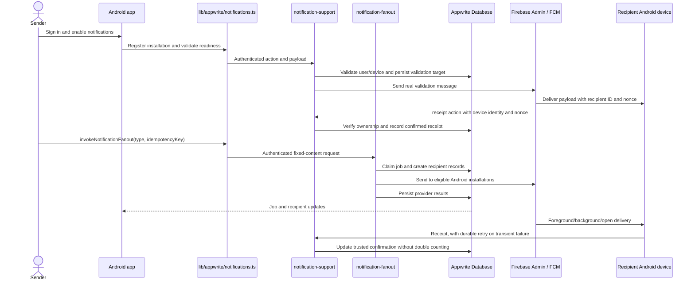

# Two-function notification deployment review

Review date: 2026-09-11. Status: local review and checklist implementation complete; external Appwrite, Firebase, native-build, and two-device checks remain open.

## Scope and architecture analysis

This review follows [AGENTS.md](../../../.devin/AGENTS.md), its analysis framework, the architect skill found at `C:/Users/ricky/.codeium/windsurf/skills/architect-agent/SKILL.md`, and [the junior checklist workflow](../../../.devin/workflows/junior-dev-checklist.md). The architect path named in AGENTS.md is stale; the existing architect-agent skill supplies the planning guidance. No `.windsurf/workflows` directory is available. The user's requested Mermaid format and output directories take precedence over the skill's generic reporting/PlantUML example.

The authoritative target is [the Option 2 PRD](../../../Project_details/notification_option2_functions_prd.md): deploy `notification-fanout` and `notification-support`. The repeated support name in the list of unwanted functions is interpreted using the user's explicit final two-function selection. Review both the original [product requirements](../../../Project_details/database_defined_push_notification_prd.md) and [backend spec](../../../Project_details/notification_option2_backend_spec_sheet.md) against source, without assuming previous reviews still describe current code. Current implementation scope is Android; multi-device acceptance means at least two physical Android installations.

Decompose the work into mobile authentication/registration/reception, trusted backend dispatch/receipt processing, and packaging/configuration/database readiness. Solve by tracing each contract and reproducing concrete defects, then create finding-specific checklists before changing their implementation. Verify with focused regression tests, TypeScript checks, clean function packaging/runtime imports, and mobile bundle/configuration checks where available. Synthesize the result with separate local evidence and external deployment/device evidence. Initial confidence in this review strategy: 0.9; live operation cannot be inferred from passing static checks.



Frontend/backend contract: fanout receives `{notificationType: 'system_test', idempotencyKey}` directly and runs asynchronously; the authenticated client locates its readable job with the same idempotency key. Support receives `{action, payload}` for profile bootstrap, device lifecycle, readiness, and receipts. Backend errors remain failures at the client execution boundary. FCM tokens, ownership checks, provider outcomes, and authoritative receipt state respect the PRD trust boundary. Each function upload contains all shared code and runnable compiled imports.

## Review and execution plan

Frontend review owns mobile call handling, device/session lifecycle, notification presentation, readiness, and receipt retry. Backend review owns shared helpers, both active function handlers, dispatch/receipt races, validation, and authorization. Deployment review owns the workspace inventory, upload boundaries, runtime build, database/schema instructions, and installation readiness. Each reviewer records precise evidence and a fix checklist in `DOCS/TaskList/` before implementing its assigned findings. Root coordinates cross-module contracts and performs final verification. Existing user changes to `.gitignore` and `.devin/` are preserved.

## Findings

The detailed evidence and fixes are in the [backend findings](Sep_1126_backend_findings.md) and [frontend findings](Sep_1126_frontend_findings.md). Fourteen concrete source defects were found and addressed locally: readable delivery nonces; non-atomic receipts and lost counts; send-before-recipient persistence; missing idempotency and rate limits; client-writable ownership/readiness; incorrect provider-failure classification; weak request/readiness validation; Expo public variable lookup that release bundling cannot inline; ignored execution failure status; revoked-token and Android permission errors; receipt queue races/account leakage; late background registration and missing foreground display; stale session/readiness work; and truncated/cross-account job monitoring.

Deployment review also reproduced a compiled-function `ERR_MODULE_NOT_FOUND`: the old individual function root omitted shared code and emitted extensionless ES-module imports. The fix restricts active workspaces to `notification-fanout` and `notification-support`, compiles CommonJS into clean staged archives, includes shared output and locked production dependencies, and smoke-tests the real archive bytes in isolated directories. The three standalone legacy folders are explicitly marked retired and cannot enter the active package commands.

The dependency pass removed the retired Function entries from the root lockfile and upgraded both active server packages to `firebase-admin@14.4.0`. A clean `npm ci` succeeds. `npm audit --omit=dev` now reports 27 advisories in the Expo SDK 54 dependency graph (18 moderate and 9 high, with no critical advisories); npm's proposed remedy is an Expo SDK 57 major migration. The product requirements explicitly pin Expo `~54.0.33`, React Native `0.81.5`, and Expo Router `~6.0.23`, so that migration is recorded as controlled follow-up work rather than silently changing the native platform baseline during a notification correctness review. The active Function packages no longer carry the Firebase Admin advisory chain.

Firebase is not the only remaining setup. The local Appwrite Project ID is empty, Firebase Android JSON is absent, EAS linkage is empty, and the existing ignored native Gradle application ID differs from `com.pushnotificationexample.app`. The source now has a safe configuration preflight, EAS Firebase file-variable support, and a clean-build path that preserves the unrecoverable ignored native tree. Appwrite still needs the documented rate-limit/index and permission migration. Confidence: 0.97 for these local findings and repairs.

## Verification and remaining setup

Local checks completed on 2026-09-11:

```text
npm run typecheck                           PASS
npm run functions:check                    PASS (two active workspaces)
npx jest --runInBand                       PASS (7 suites, 42 tests)
npm run functions:package                  PASS (two archives)
npm run functions:smoke                    PASS (isolated load and 401 for both)
npx expo export --platform android ...     PASS (1 Android bundle, 1,243 modules)
npm ci --ignore-scripts                    PASS (clean lockfile install)
npm audit --omit=dev                       REVIEW (27 Expo SDK 54 advisories; 0 critical)
git diff --check                           PASS (line-ending notices only)
npm run deployment:check                   EXPECTED BLOCKED
```

The preflight correctly reports the empty Appwrite Project ID, missing `google-services.json`, stale native application ID, pending EAS linkage, and unverified remote state without printing secrets. These are documented in the [deployment guide](Sep_1126_deployment_guide.md) and [database delta](../../db_struct_notification_deployment.md).

Remaining release gates require the account and devices: populate Appwrite/EAS public values; configure the Android platform; install schema/index and permission changes; provision both function environments; add matching Firebase Android and service-account configuration; deploy only the two generated archives; build a clean APK; and complete the two-device matrix. No live Appwrite writes, Firebase setup, native compilation, or physical-device claim was made during this review.
