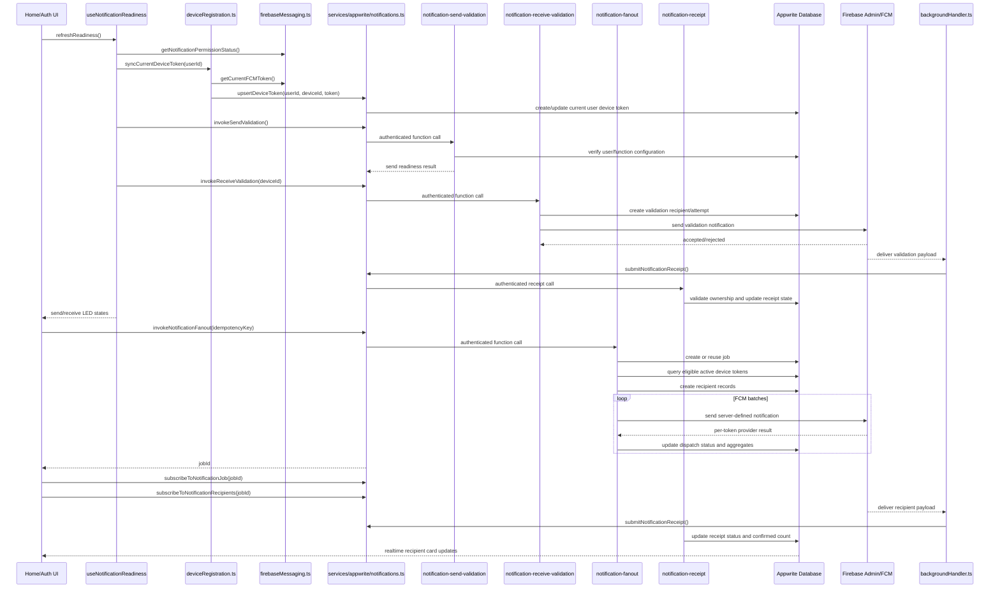

# Database-Defined Push Notification System Design

Source requirements:

- `Project_details/database_defined_push_notification_prd.md`
- `Project_details/push_notification_plantuml_diagrams.md`
- `.devin/AGENTS.md`

This design is implementation-facing. Junior-dev checklists in this repository must be checked against the two `Project_details` documents before work starts and again before handoff.

## Current Repository State

The repository currently contains project planning files only. There is no Expo app scaffold, Appwrite function source, test setup, or shared configuration in the workspace yet.

Missing referenced orchestration files:

- `.windsurf/AGENTS.md`
- `shared/analysis-framework.md`
- `shared/handoff-format.md`
- `shared/mcp-tools.md`
- `junior-dev-checklist.md`
- `C:/Users/ricky/.codeium/windsurf/skills/architect-agent-skill/SKILL.md`

Because the project details are present and complete enough to define the system, implementation can proceed from this design once the application scaffold and deployment targets are created.

## Architecture Overview

The app is a React Native Expo application backed by Appwrite and Firebase Cloud Messaging. The client registers only its own device token, validates local readiness, invokes backend functions, renders status, and submits notification receipts. All cross-device notification fanout happens in Appwrite Functions using server-side Firebase Admin credentials.

Core boundaries:

- Client owns authentication UI, permission prompts, FCM token retrieval, local device ID persistence, readiness indicators, job monitoring, notification handlers, and offline receipt retry.
- Appwrite Database owns users, device tokens, notification jobs, notification recipients, and optional append-only receipt audit records.
- Appwrite Functions own send validation, receive validation, fanout, receipt authorization, provider response mapping, token invalidation, aggregate counts, and idempotency.
- Firebase Cloud Messaging owns token issuance, push transport, provider-level acceptance, rejection, and delivery to devices.

## Proposed Project Structure

```text
app/
  _layout.tsx
  index.tsx
  auth.tsx
  notification-setup.tsx
lib/
  appwrite/
    client.ts
    notifications.ts
    auth.ts
  push-notifications/
    firebaseMessaging.ts
    deviceRegistration.ts
    backgroundHandler.ts
    payload.ts
    retryQueue.ts
hooks/
  useNotificationReadiness.ts
  useNotificationJob.ts
components/
  StatusLed.tsx
  RecipientCard.tsx
  NotificationJobSummary.tsx
functions/
  notification-send-validation/
  notification-receive-validation/
  notification-fanout/
  notification-receipt/
types/
  notifications.ts
tests/
  unit/
  integration/
docs/
  appwrite-schema.md
  environment.md
  device-test-matrix.md
```

## Data Model

Implement the collections defined in `Project_details/database_defined_push_notification_prd.md` sections 6.1 through 6.5:

- `users`
- `deviceTokens`
- `notificationJobs`
- `notificationRecipients`
- `notificationReceipts`

The client must never read raw FCM tokens belonging to other users. Backend-controlled fields such as token validity, provider response counts, receipt status, and job aggregates must be written only by functions or tightly controlled backend paths.

## Function-Level Sequence



## Frontend Contract

Status values:

```ts
type ReadinessColor = 'green' | 'yellow' | 'red';

type SendReadiness =
  | { color: 'green'; code: 'SEND_READY'; message: string }
  | { color: 'yellow'; code: 'SEND_UNTESTED' | 'SEND_TESTING' | 'SEND_STALE'; message: string }
  | { color: 'red'; code: 'AUTH_REQUIRED' | 'AUTH_FORBIDDEN' | 'FUNCTION_UNAVAILABLE'; message: string };

type ReceiveReadiness =
  | { color: 'green'; code: 'RECEIVE_VERIFIED'; message: string }
  | { color: 'yellow'; code: 'PERMISSION_NOT_REQUESTED' | 'RECEIVE_UNTESTED' | 'RECEIVE_TESTING' | 'TOKEN_RESYNC_REQUIRED'; message: string }
  | { color: 'red'; code: 'PERMISSION_DENIED' | 'FCM_TOKEN_MISSING' | 'FCM_TOKEN_INVALID' | 'DEVICE_RECORD_INACTIVE'; message: string };
```

Notification payload:

```ts
type NotificationData = {
  schemaVersion: '1';
  jobId: string;
  recipientRecordId: string;
  notificationType: 'system_test';
  receiptNonce?: string;
};
```

Fanout invocation:

```ts
type InvokeNotificationFanoutRequest = {
  notificationType: 'system_test';
  idempotencyKey: string;
};

type InvokeNotificationFanoutResponse = {
  jobId: string;
  status: 'queued' | 'processing' | 'completed' | 'partially_completed' | 'failed';
};
```

Receipt submission:

```ts
type SubmitNotificationReceiptRequest = {
  jobId: string;
  recipientRecordId: string;
  deviceId: string;
  eventType: 'received' | 'displayed' | 'opened';
  clientTimestamp: string;
  idempotencyKey: string;
  receiptNonce?: string;
};
```

Recipient card view model:

```ts
type RecipientCardView = {
  recipientRecordId: string;
  username: string;
  platform: 'ios' | 'android';
  dispatchStatus: 'pending' | 'accepted' | 'rejected' | 'error';
  receiptStatus: 'not_confirmed' | 'received' | 'opened' | 'expired';
  lastStateChangedAt: string | null;
  failureReason: string | null;
};
```

## Junior Dev Checklist

Before taking any task below, read and follow:

- `Project_details/database_defined_push_notification_prd.md`
- `Project_details/push_notification_plantuml_diagrams.md`

Every checklist item must preserve the PRD rule that the client never sends notifications directly to other users' FCM tokens.

### Phase 1: Foundation

- [ ] Confirm Expo SDK, React Native, Firebase Messaging, Appwrite, and Appwrite Function versions against PRD section 3.
- [ ] Scaffold the Expo Router app without changing the PRD-defined architecture.
- [ ] Add Firebase native configuration for development builds; do not commit private Firebase Admin credentials.
- [ ] Add Appwrite client initialization for public client-side project values only.
- [ ] Document Appwrite collection IDs and environment variables in `docs/environment.md`.
- [ ] Create the Appwrite collections from PRD section 6 and record permissions in `docs/appwrite-schema.md`.

### Phase 2: Registration And Readiness

- [ ] Implement auth screen with username/password registration and sign-in from PRD section 13.1.
- [ ] Implement stable installation `deviceId` persistence from PRD sections 8.3 and 9.2.
- [ ] Implement notification permission read/request logic from PRD section 8.8.
- [ ] Implement current FCM token retrieval and token refresh listener from PRD sections 8.3 and 8.46.
- [ ] Implement `services/appwrite/notifications.ts` methods for current-user token upsert only.
- [ ] Implement send and receive readiness LEDs using the PRD color definitions in section 7.
- [ ] Keep receive readiness yellow until device receipt validation succeeds, per PRD section 8.12.

### Phase 3: Backend Functions

- [ ] Implement `notification-send-validation` to verify auth, authorization, required environment, and Firebase Admin setup.
- [ ] Implement `notification-receive-validation` to send a validation notification only to the authenticated user's active device.
- [ ] Implement `notification-fanout` to create/reuse a job by idempotency key and query database-defined eligible tokens.
- [ ] Implement FCM batch send handling and per-recipient dispatch updates from PRD sections 8.27 and 10.1.
- [ ] Implement permanent token rejection handling so invalid tokens are excluded from later fanout.
- [ ] Implement `notification-receipt` with ownership validation, idempotency, nonce/device checks, and aggregate count updates.

### Phase 4: Notification Handling

- [ ] Register the background message handler at module initialization as required by PRD section 8.50.
- [ ] Implement foreground message handling and local display behavior.
- [ ] Implement background and terminated/open handlers that parse the versioned payload contract.
- [ ] Reject unknown notification schema versions and malformed receipt identifiers.
- [ ] Implement receipt submission for `received`, `displayed`, and `opened` events.
- [ ] Implement a capped local retry queue for offline or retryable receipt failures.

### Phase 5: Job Monitoring UI

- [ ] Implement send button idempotency and duplicate-submission prevention from PRD section 8.33.
- [ ] Subscribe only to the selected notification job and its recipient records.
- [ ] Render aggregate job counts from the job document rather than recalculating all cards.
- [ ] Render recipient cards that distinguish provider acceptance from device receipt.
- [ ] Sanitize and normalize failure explanations before display.
- [ ] Paginate recipient records so the UI remains responsive for large fanouts.

### Phase 6: Hardening And Verification

- [ ] Add unit tests listed in PRD section 20.1.
- [ ] Add integration tests listed in PRD section 20.2 where Appwrite/Firebase test infrastructure is available.
- [ ] Run the physical-device test matrix from PRD section 20.3.
- [ ] Run fanout scenarios from PRD section 20.4.
- [ ] Verify no Firebase Admin secrets, Appwrite API keys, or complete FCM tokens are logged.
- [ ] Verify listener and realtime subscription cleanup on sign-out, navigation changes, and component unmount.

## Acceptance Gate

The project is ready for implementation handoff when:

- The app scaffold exists and matches this structure or documents a deliberate deviation.
- Appwrite collections and function environment variables are documented.
- Junior-dev work items reference both `Project_details` files.
- The backend contract above is reflected in shared TypeScript types.
- The global acceptance criteria in PRD section 21 are mapped to tests or manual verification steps.

## Assumptions And Risks

- `.windsurf/AGENTS.md` is required by the user but missing from the workspace. This design uses `.devin/AGENTS.md` and the project details instead.
- The Appwrite project, Firebase project, native Firebase config files, and EAS build profile are not present yet.
- Physical-device validation is mandatory for real FCM behavior; simulator-only testing is insufficient.
- Backend functions need privileged Appwrite and Firebase Admin credentials that must remain server-side.
- Appwrite permissions must be designed before broad implementation, because incorrect document access could expose raw FCM tokens.
- The PRD recommends separate `deviceTokens`; placing lifecycle fields directly on the user document would raise duplication and security risks.

## Completion Report Format

Use this format for future agent handoffs until `shared/handoff-format.md` is available:

```text
SUMMARY:
FILES_CHANGED:
PROJECT_DETAILS_REFERENCED:
VALIDATION:
RISKS_OR_FOLLOW_UP:
```
