# Product Requirements Document  
## Database-Defined Push Notification Validation and Fanout System

**Document status:** Draft  
**Target platform:** React Native Expo mobile application  
**Primary backend:** Appwrite  
**Push provider:** Firebase Cloud Messaging  
**Version:** 1.0

---

## 1. Product Summary

This document defines the end-to-end requirements for a React Native Expo application that:

1. Registers a user and the user's physical device.
2. Requests permission to receive push notifications.
3. Stores the Firebase Cloud Messaging device token in the user's Appwrite user document.
4. Validates whether the device can receive and transmit notifications.
5. Displays separate send and receive readiness indicators.
6. Allows an authenticated user to press a button that invokes an Appwrite Function.
7. Fans out a notification to all eligible device tokens stored in the Appwrite user database.
8. Displays delivery and receipt status for each target user.
9. Receives a confirmation from each recipient device when the notification is processed.

This PRD focuses only on the technical methods required to register devices, validate tokens, send notifications, fan out notifications, receive notifications, and report confirmation. It does not define group chat, messaging rooms, social features, or application-specific notification content.

The attached implementation reference is used as an architectural guide. In particular, this PRD retains its separation between token registration, backend fanout, foreground/background handling, listener cleanup, and failure recovery, while replacing room- and message-specific behavior with database-defined recipients and explicit delivery confirmation.

---

## 2. Goals

### 2.1 Primary Goals

- Reliably register an authenticated user's current device for FCM notifications.
- Store the active FCM token and its validation state in Appwrite.
- Verify that the locally issued FCM token matches the token registered for the user.
- Clearly communicate send and receive readiness to the user.
- Send one notification request from the application to an Appwrite Function.
- Fan out the notification to all eligible users in the Appwrite user database.
- Track the status of each notification recipient.
- Record recipient-device confirmation after notification processing.
- Support foreground, background, and terminated application states.
- Detect and recover from stale, invalid, rotated, or rejected FCM tokens.

### 2.2 Non-Goals

The following are outside the scope of this PRD:

- Group chat.
- Chat rooms.
- Message persistence.
- Per-room throttling.
- Muted rooms.
- Social feeds.
- Notification preference categories beyond basic permission and readiness.
- User-created recipient groups.
- User-entered notification text.
- Rich media notifications.
- Scheduled notifications.
- Marketing campaigns.
- Topic-based FCM subscriptions unless adopted as a later optimization.

---

## 3. Technical Stack

### 3.1 Core Framework

- React Native: `0.81.5`
- React: `19.1.0`
- Expo SDK: `~54.0.33`
- Expo Router: `~6.0.23`

### 3.2 Backend and BaaS

- Appwrite: `^17.0.0`
- `react-native-appwrite`: `^0.7.4`
- Appwrite Account
- Appwrite Databases
- Appwrite Functions

### 3.3 Push Notifications

- `@react-native-firebase/app`: `^23.8.6`
- `@react-native-firebase/messaging`: `^23.8.6`
- Firebase Cloud Messaging
- Expo Notifications may be used for local foreground display and Android notification channel configuration if already available in the project.

### 3.4 Architectural Constraint

The client application must never send notifications directly to other users' FCM tokens.

The client may only:

1. Register its own token.
2. Validate its own send and receive readiness.
3. Request a backend notification job.
4. Observe notification-job status.
5. Confirm receipt of notifications addressed to the current device.

All cross-device notification delivery must occur in an Appwrite Function or another trusted server-side environment.

---

## 4. User Roles

### 4.1 Authenticated User

An authenticated user can:

- Register the current device.
- Grant notification permission.
- View send readiness.
- View receive readiness.
- Press the send-notification button.
- View recipient status cards.
- Receive notifications.
- Send a receipt confirmation to the backend.

### 4.2 Appwrite Function

The Appwrite Function is the trusted notification dispatcher. It can:

- Authenticate the requesting user.
- Query all eligible user-device records.
- Exclude invalid or disabled targets.
- Send FCM requests.
- Record per-recipient provider responses.
- Mark invalid tokens.
- Create notification-delivery records.
- Accept recipient confirmations.

### 4.3 Firebase Cloud Messaging

FCM is responsible for:

- Issuing device registration tokens.
- Rotating tokens when required.
- Delivering push payloads.
- Returning provider-level acceptance or rejection responses.

---

## 5. System Architecture

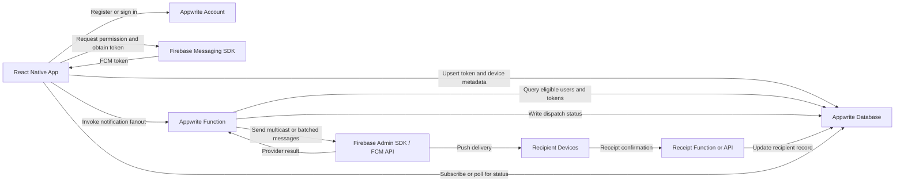

---

## 6. Core Data Model

The exact Appwrite collection names may be adapted to the existing project, but the responsibilities below must remain separate.

### 6.1 Users Collection

Each user document represents application-level identity.

| Field | Type | Required | Description |
|---|---:|---:|---|
| `userId` | string | Yes | Appwrite Account user ID. |
| `username` | string | Yes | User-selected username. |
| `notificationEnabled` | boolean | Yes | Whether the user has enabled notification registration. |
| `activeDeviceId` | string or null | No | Current primary device identifier. |
| `activeDeviceTokenId` | string or null | No | Reference to the active device-token record. |
| `createdAt` | datetime | Yes | User document creation time. |
| `updatedAt` | datetime | Yes | Last update time. |

### 6.2 Device Tokens Collection

A separate collection is recommended instead of placing all token lifecycle fields directly in the user document. The user document may still contain the active token reference.

| Field | Type | Required | Description |
|---|---:|---:|---|
| `deviceTokenId` | string | Yes | Appwrite document ID. |
| `userId` | string | Yes | Owner of the device. |
| `deviceId` | string | Yes | Stable application-generated installation identifier. |
| `fcmToken` | string | Yes | Current Firebase registration token. |
| `platform` | enum | Yes | `ios` or `android`. |
| `appVersion` | string | Yes | Installed application version. |
| `buildNumber` | string | No | Native build number. |
| `permissionStatus` | enum | Yes | `granted`, `provisional`, `denied`, `not_requested`, or `unknown`. |
| `tokenStatus` | enum | Yes | `untested`, `valid`, `invalid`, `rotated`, or `revoked`. |
| `receiveStatus` | enum | Yes | `untested`, `verified`, `failed`, or `expired`. |
| `lastValidatedAt` | datetime or null | No | Last validation attempt. |
| `lastReceivedAt` | datetime or null | No | Last confirmed notification receipt. |
| `lastTokenRefreshAt` | datetime or null | No | Last FCM token rotation. |
| `isActive` | boolean | Yes | Whether this token is eligible for fanout. |
| `createdAt` | datetime | Yes | Record creation time. |
| `updatedAt` | datetime | Yes | Record update time. |

### 6.3 Notification Jobs Collection

One document per button press.

| Field | Type | Required | Description |
|---|---:|---:|---|
| `jobId` | string | Yes | Notification job identifier. |
| `requestedByUserId` | string | Yes | User who pressed the send button. |
| `notificationType` | string | Yes | Fixed system-defined notification type. |
| `title` | string | Yes | Server-approved title. |
| `body` | string | Yes | Server-approved body. |
| `status` | enum | Yes | `queued`, `processing`, `completed`, `partially_completed`, or `failed`. |
| `targetCount` | integer | Yes | Number of eligible recipients. |
| `providerAcceptedCount` | integer | Yes | Number accepted by FCM. |
| `providerRejectedCount` | integer | Yes | Number rejected by FCM. |
| `confirmedCount` | integer | Yes | Number of recipient confirmations. |
| `createdAt` | datetime | Yes | Job creation time. |
| `completedAt` | datetime or null | No | Fanout completion time. |

### 6.4 Notification Recipients Collection

One document per notification job and target device.

| Field | Type | Required | Description |
|---|---:|---:|---|
| `recipientRecordId` | string | Yes | Appwrite document ID. |
| `jobId` | string | Yes | Parent notification job. |
| `recipientUserId` | string | Yes | Target user. |
| `deviceTokenId` | string | Yes | Target token record. |
| `providerMessageId` | string or null | No | FCM response identifier, when available. |
| `dispatchStatus` | enum | Yes | `pending`, `accepted`, `rejected`, or `error`. |
| `receiptStatus` | enum | Yes | `not_confirmed`, `received`, `opened`, or `expired`. |
| `failureCode` | string or null | No | Normalized FCM or server error. |
| `failureMessage` | string or null | No | Sanitized diagnostic message. |
| `dispatchedAt` | datetime or null | No | Time sent to FCM. |
| `receivedAt` | datetime or null | No | Time recipient confirmed processing. |
| `openedAt` | datetime or null | No | Optional time user opened notification. |

### 6.5 Notification Receipts Collection

A separate receipt collection may be used for append-only audit history.

| Field | Type | Required | Description |
|---|---:|---:|---|
| `receiptId` | string | Yes | Unique idempotency key. |
| `jobId` | string | Yes | Notification job. |
| `recipientRecordId` | string | Yes | Recipient record. |
| `recipientUserId` | string | Yes | Confirming user. |
| `deviceId` | string | Yes | Confirming installation. |
| `eventType` | enum | Yes | `received`, `displayed`, or `opened`. |
| `clientTimestamp` | datetime | Yes | Device-reported event time. |
| `serverTimestamp` | datetime | Yes | Backend receipt time. |

---

## 7. Status Indicator Definitions

The home screen displays two labeled status indicators.

### 7.1 Send Notification Indicator

This indicator represents whether the current user may invoke the fanout function.

| Color | Meaning |
|---|---|
| Green | User is authenticated, the Appwrite Function is reachable, the user's session is valid, and the backend authorizes the send action. |
| Red | User is unauthenticated, unauthorized, backend validation failed, or the function is unavailable after a completed test. |
| Yellow | Send capability has not yet been tested, validation is in progress, or the last test result is stale. |

### 7.2 Receive Notification Indicator

This indicator represents whether the current device is registered and verified for FCM reception.

| Color | Meaning |
|---|---|
| Green | Permission is granted, an FCM token exists, the token matches Appwrite, the token is active, and a validation notification has been confirmed. |
| Red | Permission is denied, no token exists, token does not match Appwrite, FCM rejected the token, or the validation notification failed. |
| Yellow | Permission is not yet requested, token validation has not completed, or the validation result has expired. |

### 7.3 Important Distinction

FCM provider acceptance is not equivalent to device receipt.

- **Provider accepted:** FCM accepted the message for delivery.
- **Device received:** The recipient application processed the payload and submitted a receipt.
- **Notification opened:** The user tapped the notification.

The UI must label these states separately.

---

# 8. Feature Requirements

## Feature 1: User Registration, Sign-In, and Device Registration

### 8.1 Objective

Create or authenticate the user, obtain an FCM token for the current application installation, and associate it with the user's Appwrite record.

### 8.2 Preconditions

- Firebase native configuration is included in the development build.
- The application is running in an Expo development build or production build, not an unsupported environment.
- Appwrite Account and Database clients are initialized.
- A stable installation-specific `deviceId` can be generated and persisted.

### 8.3 Requirements

1. The user can create an account using username and password.
2. The client creates an Appwrite Account session after registration or sign-in.
3. The application requests notification permission after authentication unless it has already been resolved.
4. The application obtains the current FCM token.
5. The application creates or updates a device-token record.
6. The application stores a reference to the active token record in the user's document.
7. The application must not create duplicate active token records for the same `userId + deviceId`.
8. The application must update the existing record when the FCM token rotates.
9. A token belonging to a signed-out user must not remain silently associated with a new user on the same installation.
10. Sign-out must deactivate or disassociate the current user-device token according to the product's account-switching policy.

### 8.4 Registration Sequence

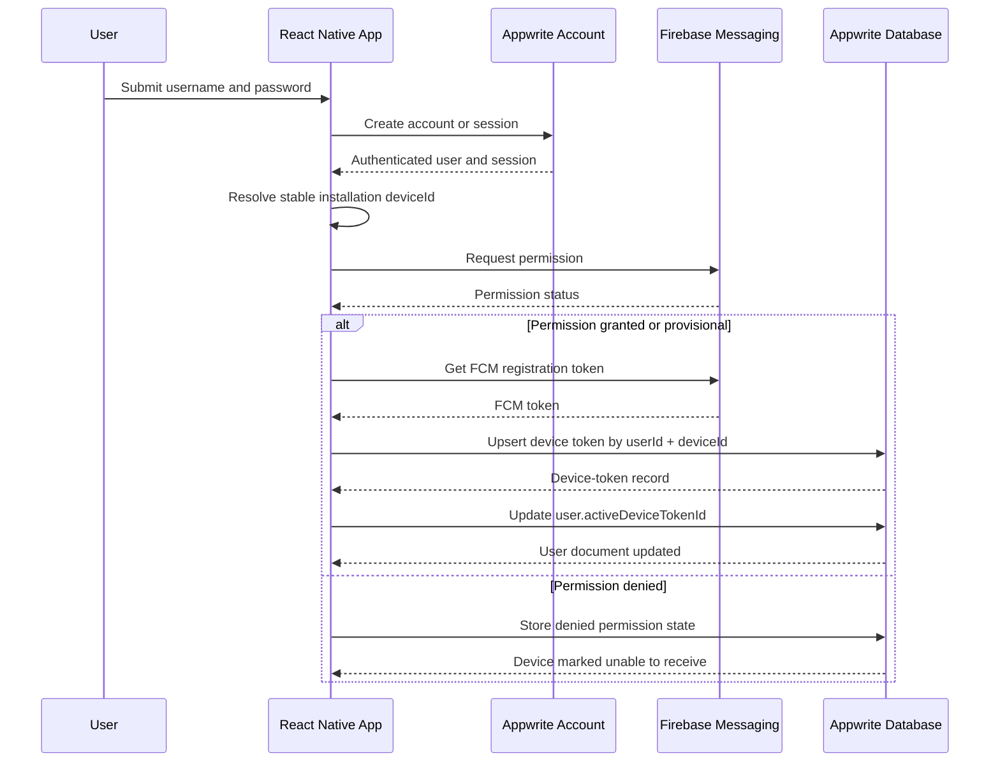

### 8.5 Error Handling

- If account creation succeeds but token registration fails, sign-in remains successful.
- The receive indicator remains yellow during retryable failures.
- The receive indicator becomes red for denied permission or confirmed invalid tokens.
- Token sync must retry on application foreground and network recovery.
- Authentication credentials and FCM server credentials must never be logged.

### 8.6 Acceptance Criteria

- A newly registered user has one user document and one active device-token document.
- Reopening the app does not create duplicate token documents.
- Signing in on a second device creates a second device-token document.
- Token rotation updates the correct device record.
- Permission denial is persisted and reflected in the UI.

---

## Feature 2: Notification Permission Request

### 8.7 Objective

Obtain the operating system's permission to display and receive notifications and persist the result.

### 8.8 Requirements

1. The application determines the current permission state before requesting permission.
2. The permission request occurs after sign-in and before receive validation.
3. iOS authorization states must be normalized into the application's permission enum.
4. Android runtime notification permission must be handled for Android versions that require it.
5. Android notification channels must be configured before displaying notifications.
6. The user must not be repeatedly prompted after denial.
7. The application must provide a path to operating-system settings when permission is denied.
8. Permission state must be rechecked when the application returns to the foreground.

### 8.9 Flow Diagram

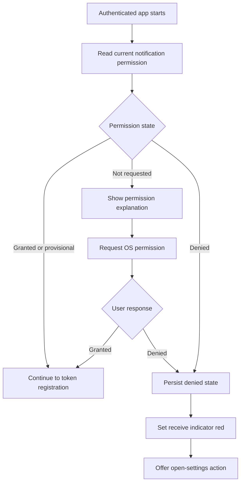

### 8.10 Acceptance Criteria

- The application does not request permission before the user is authenticated.
- The OS prompt is shown only when appropriate.
- Denial does not cause an infinite request loop.
- Permission changes made in system settings are detected after returning to the app.

---

## Feature 3: Token and Device Validation

### 8.11 Objective

Verify that the current device's locally issued FCM token is registered in Appwrite and can receive a test notification.

### 8.12 Validation Levels

#### Level 1: Local Validation

- Firebase SDK is initialized.
- Notification permission is granted or provisional.
- `getToken()` returns a non-empty token.
- A stable `deviceId` exists.

#### Level 2: Database Validation

- A device-token document exists for the authenticated user and current device.
- The locally returned FCM token matches the active Appwrite token.
- The token record is active.
- The token has not been marked invalid or revoked.

#### Level 3: Provider Validation

The backend sends a test notification to the current device token.

- If FCM rejects the token as unregistered or invalid, mark the token invalid.
- If FCM accepts the notification, mark dispatch as accepted but do not yet mark receive validation green.

#### Level 4: Device Receipt Validation

The device receives the validation notification and submits a receipt to the backend.

- The backend marks the validation attempt verified.
- The device record's `receiveStatus` becomes `verified`.
- The receive indicator becomes green.

### 8.13 Validation Flow

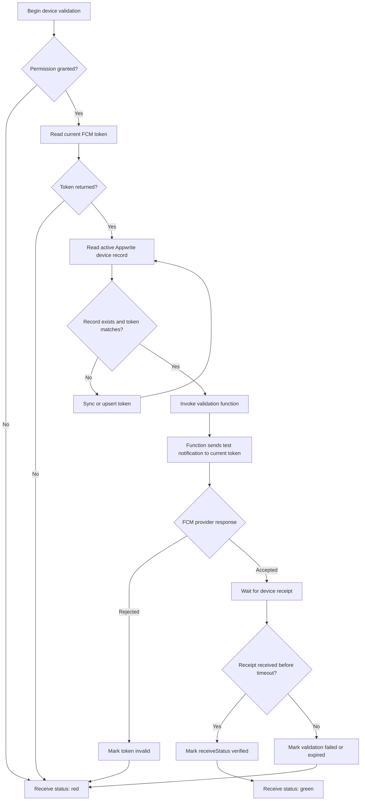

### 8.14 Validation Timeout

A validation attempt must have an expiration time. Recommended initial value:

- Provider-response timeout: 30 seconds.
- Device-receipt timeout: 60 seconds.

The exact values must be configurable through environment settings.

### 8.15 Acceptance Criteria

- A matching database token without a receipt remains yellow until tested.
- Provider rejection produces a red receive indicator.
- A confirmed validation receipt produces a green receive indicator.
- A rotated local token causes a database resync before validation.
- A validation receipt is idempotent.

---

## Feature 4: Home-Screen Readiness Indicators

### 8.16 Objective

Display the user's current ability to send and receive notifications.

### 8.17 UI Requirements

The home screen contains:

1. A labeled send-status LED.
2. A labeled receive-status LED.
3. Text explaining each current state.
4. A refresh or retest action.
5. The send-notification button.
6. A list of per-user notification-result cards below the button.

### 8.18 State Derivation

The client must derive indicator colors from backend and local states rather than setting colors directly in arbitrary components.

Recommended state object:

```ts
type NotificationReadiness = {
  send: {
    status: 'valid' | 'invalid' | 'untested' | 'testing';
    reasonCode: string;
    checkedAt: string | null;
  };
  receive: {
    status: 'valid' | 'invalid' | 'untested' | 'testing';
    reasonCode: string;
    checkedAt: string | null;
  };
};
```

Color mapping:

- `valid` -> green
- `invalid` -> red
- `untested` -> yellow
- `testing` -> yellow with activity animation

### 8.19 Indicator Flow

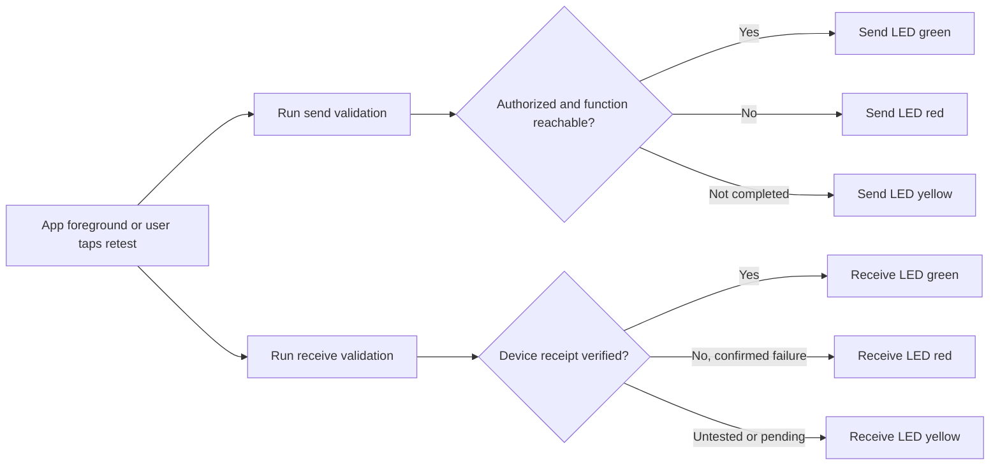

### 8.20 Acceptance Criteria

- Indicators survive navigation and application restarts.
- Stale validation results automatically return to yellow after a configurable period.
- The send button is disabled when send readiness is red.
- The UI explains why an indicator is red or yellow.

---

## Feature 5: Send Notification Button

### 8.21 Objective

Allow an authenticated and authorized user to start a server-side notification fanout job.

### 8.22 Requirements

1. The button is enabled only when send readiness is green.
2. One button press creates one idempotent notification job.
3. The client generates an idempotency key before invoking the function.
4. Repeated taps while a request is pending must not create duplicate jobs.
5. The client sends no recipient tokens in the request.
6. The client sends no Firebase server credentials.
7. The Appwrite Function determines all recipients from the database.
8. Notification title, body, and data must be server-controlled or server-validated.
9. The function returns a `jobId`.
10. The UI navigates into the active job state and begins observing recipient results.

### 8.23 Client Request Example

```json
{
  "idempotencyKey": "uuid-generated-on-client",
  "notificationType": "system_test",
  "clientRequestedAt": "ISO-8601 timestamp"
}
```

### 8.24 Server Response Example

```json
{
  "jobId": "appwrite-document-id",
  "status": "queued",
  "accepted": true
}
```

### 8.25 Flow Diagram

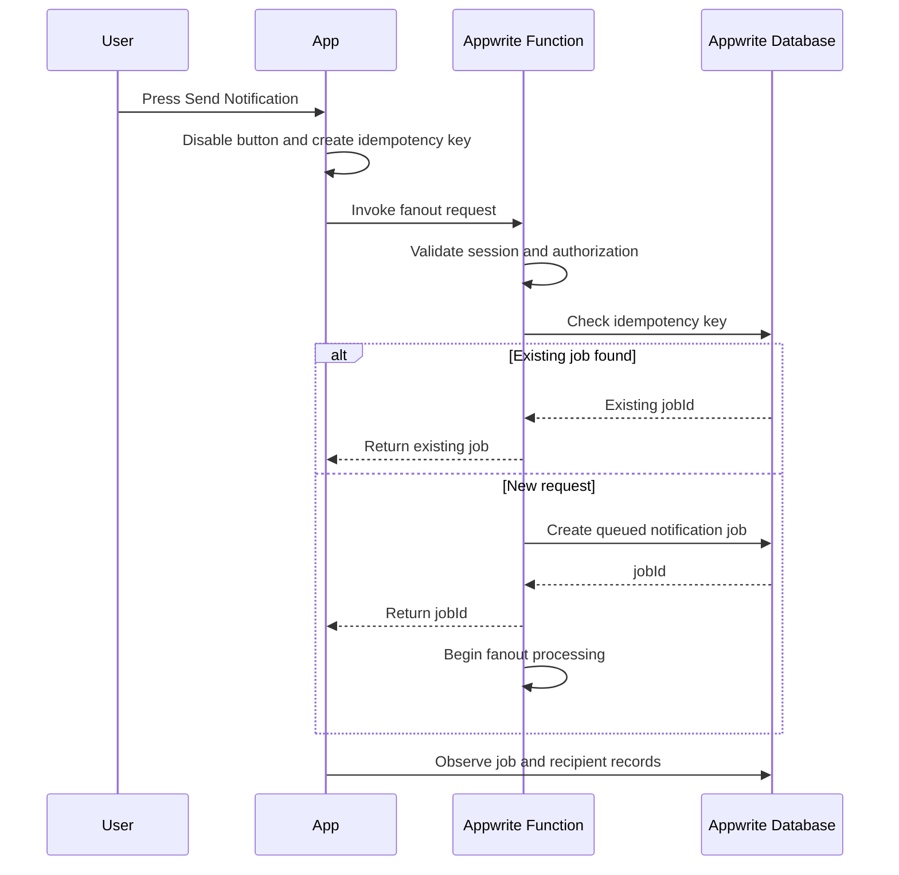

### 8.26 Acceptance Criteria

- Double tapping does not duplicate fanout.
- A user cannot provide arbitrary FCM tokens.
- An unauthorized user receives a controlled error.
- The client receives a usable `jobId`.
- The UI shows queued and processing states.

---

## Feature 6: Backend Fanout Algorithm

### 8.27 Objective

Distribute a notification to all eligible device tokens defined in the Appwrite database.

### 8.28 Eligibility Rules

A device token is eligible when:

- The user account is active.
- The device-token record is active.
- Notification permission is granted or provisional.
- `tokenStatus` is not `invalid`, `revoked`, or `rotated`.
- The FCM token is non-empty.
- The token has not been superseded by a newer token for the same device.
- The current business rule does not exclude the requesting user.

Whether the sender's own device is included must be a configurable server-side policy.

### 8.29 Fanout Method

The recommended first implementation is per-token or multicast FCM delivery through the Firebase Admin SDK.

The function must:

1. Validate the Appwrite execution context.
2. Create or reuse the notification job.
3. Query eligible device-token documents.
4. Create pending recipient records.
5. Split tokens into provider-supported batch sizes.
6. Send each batch through Firebase Admin SDK.
7. Map each provider result back to one recipient record.
8. Mark accepted, rejected, or errored results.
9. Deactivate permanently invalid tokens.
10. Preserve retryable failures for a controlled retry.
11. Update aggregate counts on the notification job.
12. Mark the job completed, partially completed, or failed.

### 8.30 Fanout Flow

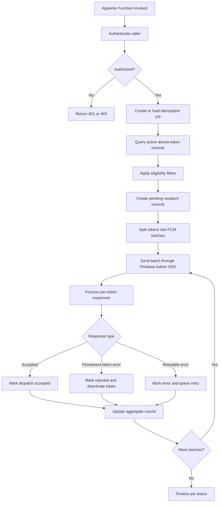

### 8.31 Retry Policy

Retry only transient failures, such as:

- Network timeout.
- Provider unavailable.
- Internal provider error.
- Rate limiting.

Do not retry permanent token failures, such as:

- Unregistered token.
- Invalid registration token.
- Sender ID mismatch.
- Malformed token.

Recommended retry schedule:

- Attempt 1: immediate.
- Attempt 2: 30 seconds.
- Attempt 3: 2 minutes.
- Attempt 4: 10 minutes.

The retry count and timing must be configurable.

### 8.32 Acceptance Criteria

- Every eligible device produces one recipient record.
- Every FCM response maps back to the correct recipient.
- Invalid tokens are marked unusable.
- Partial provider failure does not fail the entire job.
- Job counts match recipient-record states.
- Secrets remain server-side.

---

## Feature 7: Recipient Result Cards

### 8.33 Objective

Display every database user targeted by the notification and the current state of delivery to that user's active device or devices.

### 8.34 Card Requirements

Each card displays:

- Username.
- Device platform.
- Dispatch state.
- Receipt state.
- Provider acceptance time.
- Device confirmation time.
- Failure reason, when present.
- Retry state, when present.

### 8.35 Recommended Status Labels

| Internal State | User-Facing Label |
|---|---|
| `pending` | Pending |
| `accepted` + `not_confirmed` | Sent to provider |
| `accepted` + `received` | Received by device |
| `accepted` + `opened` | Opened |
| `rejected` | Rejected |
| `error` | Delivery error |
| `expired` | Confirmation timed out |

### 8.36 Data Loading

The app may use:

- Appwrite Realtime subscriptions for job and recipient document updates.
- Paginated polling as a fallback.
- A manual refresh action.

Realtime listeners must unsubscribe when the screen unmounts or the observed job changes.

### 8.37 Card Update Flow

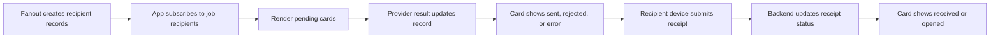

### 8.38 Acceptance Criteria

- Cards appear for all targeted recipient records.
- Card ordering is deterministic.
- Cards update without requiring a full application restart.
- Provider acceptance is not mislabeled as device receipt.
- Failure messages do not expose secrets or raw credentials.

---

## Feature 8: Notification Reception and Device Confirmation

### 8.39 Objective

Process incoming notifications in foreground, background, and terminated states, then confirm processing to the backend.

### 8.40 Push Payload

Each notification must contain a data payload similar to:

```json
{
  "jobId": "notification-job-id",
  "recipientRecordId": "recipient-record-id",
  "recipientUserId": "target-user-id",
  "notificationType": "system_test",
  "receiptNonce": "short-lived-signed-or-random-value"
}
```

The backend must not trust `recipientUserId` from the client without matching it to the authenticated session.

### 8.41 Reception States

#### Foreground

- Firebase `onMessage` receives the payload.
- The application optionally displays a local notification.
- The application submits a `received` receipt.
- Duplicate payloads are ignored through idempotency.

#### Background

- A module-level background handler processes the message.
- The application or operating system displays the notification.
- The handler stores a pending receipt if the network is unavailable.
- The receipt is retried when possible.

#### Terminated

- FCM or the operating system displays the notification.
- When the user opens the application from the notification, the initial-notification handler reads the payload.
- The application submits `received` and optionally `opened` receipts.
- Receipt submission is idempotent.

### 8.42 Reception Flow

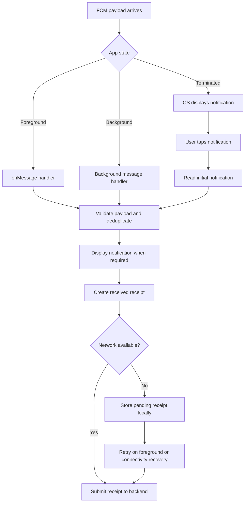

### 8.43 Receipt Security

The receipt endpoint or Appwrite Function must:

- Require an authenticated Appwrite session.
- Confirm that the authenticated user matches the recipient record.
- Confirm that the device ID matches the device-token record where applicable.
- Reject receipts for unrelated jobs.
- Enforce idempotency.
- Validate or compare the receipt nonce when used.
- Use the server timestamp as the authoritative receipt time.

### 8.44 Acceptance Criteria

- Foreground delivery produces a receipt.
- Background processing produces a receipt or a persisted retry.
- Opening from a terminated state updates the relevant recipient record.
- Duplicate delivery does not create duplicate receipts.
- A user cannot confirm another user's notification.

---

## Feature 9: FCM Token Rotation and Lifecycle Management

### 8.45 Objective

Keep Appwrite synchronized with the current FCM token throughout the installation lifecycle.

### 8.46 Requirements

1. Register an FCM token after successful sign-in.
2. Compare the local token with the active Appwrite token during application startup.
3. Listen for FCM token refresh events.
4. Update the existing device-token record when the token changes.
5. Mark the previous token as rotated or replace it atomically.
6. Resubmit any pending receive validation after rotation.
7. Detect provider errors that indicate a stale token.
8. Deactivate tokens on user sign-out according to the account-switching policy.
9. Remove or deactivate tokens when the user deletes the account.
10. Store only the token data necessary for delivery.

### 8.47 Token Lifecycle Flow

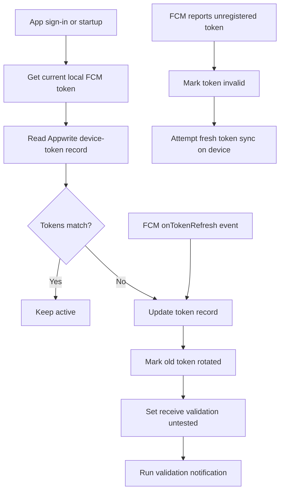

### 8.48 Acceptance Criteria

- Token refresh does not create unnecessary duplicate device records.
- Invalid tokens are excluded from later fanout.
- A rotated token returns the receive indicator to yellow until revalidated.
- Signing out prevents accidental association with the next account.

---

## Feature 10: Background Failure Recovery

### 8.49 Objective

Preserve notification receipts and processing failures that occur while the application is backgrounded or offline.

### 8.50 Requirements

1. The background message handler must be registered at module initialization.
2. Failed receipt submissions must be stored locally.
3. Stored failures must use namespaced keys.
4. The queue must be capped to prevent unbounded storage.
5. Each queue item must contain an idempotency key.
6. Pending items must retry when:
   - The app returns to foreground.
   - The user signs in.
   - Connectivity is restored, when a connectivity listener already exists.
7. Successful retries are removed from local storage.
8. Permanently rejected receipts are removed and logged as terminal failures.
9. The queue must not contain Firebase server credentials or Appwrite secrets.

### 8.51 Recovery Flow

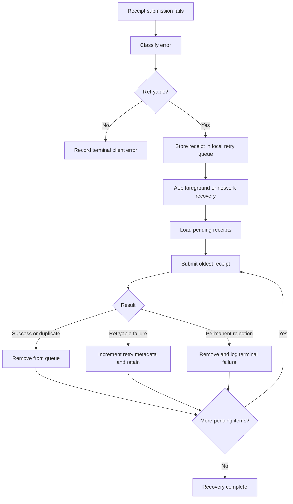

### 8.52 Acceptance Criteria

- Offline receipt confirmation is retried later.
- The queue remains within its configured maximum size.
- Duplicate receipt responses are treated as success.
- A malformed receipt does not retry indefinitely.

---

# 9. Client Modules

The final filenames may follow the existing project conventions.

## 9.1 `lib/push-notifications/firebaseMessaging.ts`

Responsibilities:

- Verify Firebase initialization.
- Request notification permission.
- Get the current FCM token.
- Listen for token refresh.
- Register foreground message listeners.
- Register notification-open listeners.
- Normalize Firebase errors.
- Configure Android channels where applicable.

Suggested exports:

```ts
ensureFirebaseInitialized()
getNotificationPermissionStatus()
requestNotificationPermission()
getCurrentFCMToken()
subscribeToTokenRefresh(callback)
subscribeToForegroundMessages(callback)
subscribeToNotificationOpened(callback)
getInitialNotification()
configureNotificationChannels()
```

## 9.2 `lib/push-notifications/deviceRegistration.ts`

Responsibilities:

- Resolve the stable installation device ID.
- Upsert the Appwrite device-token record.
- Compare the local token with the backend token.
- Deactivate a token during sign-out.
- Trigger token resync after rotation.

Suggested exports:

```ts
getOrCreateDeviceId()
syncCurrentDeviceToken(userId)
deactivateCurrentDeviceToken(userId)
validateLocalAndDatabaseToken(userId)
```

## 9.3 `lib/push-notifications/backgroundHandler.ts`

Responsibilities:

- Register the background Firebase handler at module load.
- Normalize incoming payloads.
- Persist pending receipt submissions.
- Retry failed receipts.

Suggested exports:

```ts
registerBackgroundMessagingHandler()
storePendingReceipt()
retryPendingReceipts()
```

The background handler module must be imported early in the native application entry path.

## 9.4 `hooks/useNotificationReadiness.ts`

Responsibilities:

- Load send and receive status.
- Run send-capability checks.
- Run receive validation.
- Expose color-ready UI state.
- Refresh stale results.
- Manage listener cleanup.

Suggested return value:

```ts
{
  sendStatus,
  receiveStatus,
  isTesting,
  testSendCapability,
  testReceiveCapability,
  refreshReadiness
}
```

## 9.5 `hooks/useNotificationJob.ts`

Responsibilities:

- Invoke the fanout function.
- Prevent duplicate button submissions.
- Observe the notification job.
- Observe recipient records.
- Expose aggregate counts.
- Clean up Appwrite Realtime subscriptions.

## 9.6 `services/appwrite/notifications.ts`

All Appwrite notification calls must be centralized here.

Suggested exports:

```ts
upsertDeviceToken()
getCurrentDeviceTokenRecord()
deactivateDeviceToken()
invokeSendValidation()
invokeReceiveValidation()
invokeNotificationFanout()
submitNotificationReceipt()
getNotificationJob()
listNotificationRecipients()
subscribeToNotificationJob()
subscribeToNotificationRecipients()
```

---

# 10. Backend Functions

## 10.1 `notification-fanout`

Purpose:

- Authorize the requester.
- Create an idempotent notification job.
- Query eligible database tokens.
- Fan out the FCM message.
- Store per-recipient results.
- Mark invalid tokens.
- Finalize job aggregates.

## 10.2 `notification-receipt`

Purpose:

- Authenticate the recipient user.
- Validate recipient ownership.
- Accept `received`, `displayed`, or `opened` events.
- Enforce idempotency.
- Update recipient status.
- Update job aggregate counts.

## 10.3 `notification-receive-validation`

Purpose:

- Send a test notification only to the authenticated user's current device.
- Create a validation attempt.
- Wait for a receipt asynchronously.
- Mark the device verified or expired.

## 10.4 `notification-send-validation`

Purpose:

- Verify the authenticated user may invoke the fanout function.
- Verify required environment configuration.
- Verify Firebase Admin initialization.
- Return a readiness result without notifying every user.

---

# 11. Appwrite Permissions

## 11.1 User Documents

- A user may read and update only permitted fields in their own user document.
- Token validity fields controlled by the backend must not be freely writable by the client.

## 11.2 Device Token Documents

- The client may create or update its own device registration through a controlled backend method or restrictive document permissions.
- The client must not read other users' raw FCM tokens.
- FCM tokens must never be included in recipient-card responses.

## 11.3 Notification Jobs

- The requesting user may read jobs they created.
- Broader visibility, if required, must be intentionally defined.
- Only backend functions may update provider result counts.

## 11.4 Recipient Records

- The sender may read sanitized delivery results for the job they created.
- A recipient may read the record addressed to them if required.
- Raw FCM token values must not be exposed.

## 11.5 Receipts

- Clients may submit receipts only for the authenticated user's recipient records.
- Only the backend writes authoritative receipt timestamps and aggregate counts.

---

# 12. Notification Payload Contract

## 12.1 Data Payload

Required:

```ts
type NotificationData = {
  schemaVersion: '1';
  jobId: string;
  recipientRecordId: string;
  notificationType: 'system_test';
  receiptNonce?: string;
};
```

## 12.2 Notification Display Payload

```ts
type NotificationDisplay = {
  title: string;
  body: string;
  androidChannelId?: string;
  sound?: string;
};
```

## 12.3 Payload Rules

- Payloads must be versioned.
- Required identifiers must be strings.
- Unknown schema versions must not be processed as valid receipts.
- The display title and body must be server-defined.
- Sensitive database information must not be included.
- The payload must remain within FCM size limits.
- Receipt identifiers must not be treated as authorization by themselves.

---

# 13. Screen Requirements

## 13.1 Authentication Screen

Contains:

- Username field.
- Password field.
- Register action.
- Sign-in action.
- Authentication error state.

## 13.2 Notification Setup State

May be a screen, modal, or inline section.

Contains:

- Permission explanation.
- Permission request action.
- Current permission state.
- Token registration progress.
- Open-settings action after denial.

## 13.3 Home Screen

Contains, in order:

1. Send notification status label and LED.
2. Receive notification status label and LED.
3. Status explanation text.
4. Retest or refresh action.
5. Send notification button.
6. Active notification job summary.
7. Recipient result cards.

## 13.4 Recipient Card

Contains:

- Username.
- Device platform.
- Current dispatch status.
- Current receipt status.
- Time of last state change.
- Sanitized failure reason.

---

# 14. End-to-End Application Flow

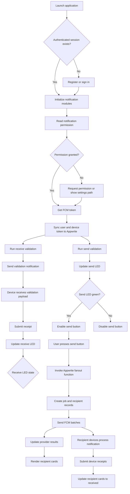

---

# 15. Error Model

All client- and backend-visible errors must use normalized codes.

Recommended codes:

- `AUTH_REQUIRED`
- `AUTH_FORBIDDEN`
- `PERMISSION_NOT_REQUESTED`
- `PERMISSION_DENIED`
- `FIREBASE_NOT_INITIALIZED`
- `FCM_TOKEN_MISSING`
- `FCM_TOKEN_MISMATCH`
- `FCM_TOKEN_INVALID`
- `FCM_TOKEN_UNREGISTERED`
- `DEVICE_RECORD_MISSING`
- `DEVICE_RECORD_INACTIVE`
- `FUNCTION_UNAVAILABLE`
- `FANOUT_ALREADY_RUNNING`
- `FANOUT_PARTIAL_FAILURE`
- `RECEIPT_UNAUTHORIZED`
- `RECEIPT_DUPLICATE`
- `RECEIPT_EXPIRED`
- `NETWORK_UNAVAILABLE`
- `UNKNOWN_NOTIFICATION_SCHEMA`

The UI must map codes to user-readable explanations without exposing raw stack traces.

---

# 16. Observability and Logging

## 16.1 Required Events

- User authenticated.
- Permission checked.
- Permission requested.
- Permission granted or denied.
- FCM token obtained.
- FCM token refreshed.
- Device token synchronized.
- Receive validation started.
- Receive validation accepted by provider.
- Receive validation confirmed by device.
- Fanout job created.
- Fanout batch sent.
- Token accepted or rejected.
- Receipt submitted.
- Receipt retry queued.
- Notification job finalized.

## 16.2 Logging Rules

- Never log complete FCM tokens.
- Never log Firebase private keys.
- Never log Appwrite API keys.
- Token identifiers may be hashed or truncated.
- Production logs must use structured JSON.
- Every backend invocation must include a correlation ID or job ID.
- Per-recipient failures must be diagnosable without exposing sensitive data.

---

# 17. Environment Configuration

Required server-side variables may include:

```text
APPWRITE_ENDPOINT
APPWRITE_PROJECT_ID
APPWRITE_API_KEY
APPWRITE_DATABASE_ID
APPWRITE_USERS_COLLECTION_ID
APPWRITE_DEVICE_TOKENS_COLLECTION_ID
APPWRITE_NOTIFICATION_JOBS_COLLECTION_ID
APPWRITE_NOTIFICATION_RECIPIENTS_COLLECTION_ID
APPWRITE_NOTIFICATION_RECEIPTS_COLLECTION_ID
FIREBASE_PROJECT_ID
FIREBASE_CLIENT_EMAIL
FIREBASE_PRIVATE_KEY
NOTIFICATION_VALIDATION_TIMEOUT_SECONDS
NOTIFICATION_RECEIPT_TIMEOUT_SECONDS
NOTIFICATION_MAX_RETRIES
NOTIFICATION_INCLUDE_SENDER
```

Client-side configuration must include only public project configuration required by the Firebase and Appwrite client SDKs.

---

# 18. Performance Requirements

- The send button must return a `jobId` promptly without waiting for every recipient confirmation.
- Fanout must be processed in provider-supported batches.
- Recipient records must be paginated.
- Realtime updates must not subscribe to the entire users collection.
- The UI must remain responsive for at least 1,000 recipient records.
- Aggregate job counts should be read from the job document rather than recalculated on every client render.
- The function must avoid loading an unbounded number of tokens into memory when the database becomes large.

---

# 19. Security Requirements

- Cross-device notification delivery occurs only on the backend.
- Firebase Admin credentials remain server-side.
- Users cannot read other users' FCM tokens.
- Users cannot submit receipts for other users.
- All function calls require Appwrite authentication unless explicitly designed otherwise.
- Fanout requests must be rate limited.
- Fanout requests must be idempotent.
- Notification content must be server-controlled or validated.
- Receipt events must be idempotent.
- Database queries must apply document-level authorization and backend validation.
- Logs must redact token values.
- Environment-specific secrets must not be committed to source control.

---

# 20. Testing Requirements

## 20.1 Unit Tests

- Permission-state normalization.
- Status-to-color mapping.
- Local token versus database-token comparison.
- Recipient eligibility filtering.
- FCM error classification.
- Retry classification.
- Receipt idempotency.
- Notification payload parsing.
- Unknown schema-version rejection.
- Job aggregate calculations.

## 20.2 Integration Tests

- Registration creates the correct Appwrite records.
- Token refresh updates the existing device record.
- Validation function sends only to the current device.
- Fanout function queries eligible database tokens.
- FCM responses update the correct recipient records.
- Invalid tokens are deactivated.
- Receipt function verifies authenticated ownership.
- Appwrite Realtime updates the correct cards.

## 20.3 Device Tests

At minimum:

- Android physical device, foreground.
- Android physical device, background.
- Android physical device, terminated.
- iOS physical device, foreground.
- iOS physical device, background.
- iOS physical device, terminated.
- Permission denied.
- Permission later enabled in system settings.
- Token rotation.
- Offline receipt queue.
- App account switch on the same device.
- Multiple devices signed into one account.

## 20.4 Fanout Tests

- Zero eligible recipients.
- One eligible recipient.
- Multiple recipients.
- Duplicate FCM tokens.
- Mixed valid and invalid tokens.
- Provider partial failure.
- Rate limiting.
- Function timeout.
- Duplicate button submission.
- Retryable batch failure.
- Permanent token rejection.

---

# 21. Global Acceptance Criteria

The implementation is accepted when all of the following are true:

1. A user can register or sign in with username and password.
2. The application requests notification permission at the correct point.
3. A valid FCM token is stored against the current user and device.
4. Token rotation updates Appwrite.
5. The receive indicator is yellow before validation.
6. The receive indicator is green only after a device receipt confirms a validation notification.
7. The receive indicator is red after a confirmed permission or token failure.
8. The send indicator accurately reflects backend authorization and function readiness.
9. Pressing the send button invokes an Appwrite Function.
10. The Appwrite Function independently queries database-defined recipients.
11. The client never sends recipient FCM tokens.
12. Each eligible device receives a recipient record.
13. Each provider response updates the correct recipient record.
14. Each recipient device can send an authenticated receipt confirmation.
15. Recipient cards distinguish provider acceptance from device receipt.
16. Foreground, background, and terminated notification flows are supported.
17. Failed receipt submissions persist and retry.
18. Duplicate fanout requests and duplicate receipts are idempotent.
19. Permanently invalid tokens are excluded from later fanout.
20. All listeners and subscriptions are cleaned up appropriately.
21. No Firebase Admin or Appwrite server secrets are exposed to the client.
22. No group-chat-specific logic is required for the notification system to function.

---

# 22. Recommended Implementation Order

## Phase 1: Foundation

- Configure Firebase native files.
- Confirm Expo development-build support.
- Configure Appwrite collections and permissions.
- Create device ID persistence.
- Implement permission and token retrieval.

## Phase 2: Registration and Readiness

- Implement Appwrite token upsert.
- Implement token refresh listener.
- Implement send validation.
- Implement receive validation.
- Implement home-screen LEDs.

## Phase 3: Fanout

- Create notification job schema.
- Create recipient schema.
- Implement idempotent fanout function.
- Integrate Firebase Admin SDK.
- Implement provider result mapping.

## Phase 4: Receipt Confirmation

- Implement foreground handler.
- Implement background handler.
- Implement terminated/open handler.
- Implement receipt function.
- Implement local failed-receipt queue.

## Phase 5: Job Monitoring UI

- Implement send button.
- Implement Realtime job subscription.
- Implement recipient cards.
- Implement aggregate status display.
- Implement failure explanations.

## Phase 6: Hardening

- Add rate limiting.
- Add structured logging.
- Add retry handling.
- Add stale-token cleanup.
- Run physical-device test matrix.
- Document environment setup and operational recovery.

---

# 23. Source Adaptation Notes

The reference implementation separates notification behavior into token registration and synchronization, foreground handling, background handling, backend fanout, tap handling, listener cleanup, and failure recovery. This PRD preserves those architectural boundaries.

The following reference concepts are intentionally retained:

- FCM token registration and backend synchronization.
- Token refresh handling.
- Module-level background message handling.
- Backend-authoritative cross-device fanout.
- Foreground, background, and terminated-state support.
- Failure persistence and retry.
- Appwrite as the backend integration point.
- Cleanup of notification listeners.

The following reference concepts are intentionally excluded or replaced:

- Group rooms are replaced by the complete eligible user-device dataset.
- Chat messages are replaced by a fixed server-defined notification event.
- Per-room throttling is excluded.
- Chat navigation is excluded.
- Muted rooms and quiet-hour preferences are excluded.
- Message caching and optimistic reconciliation are excluded.
- Sender exclusion is made a configurable server policy.
