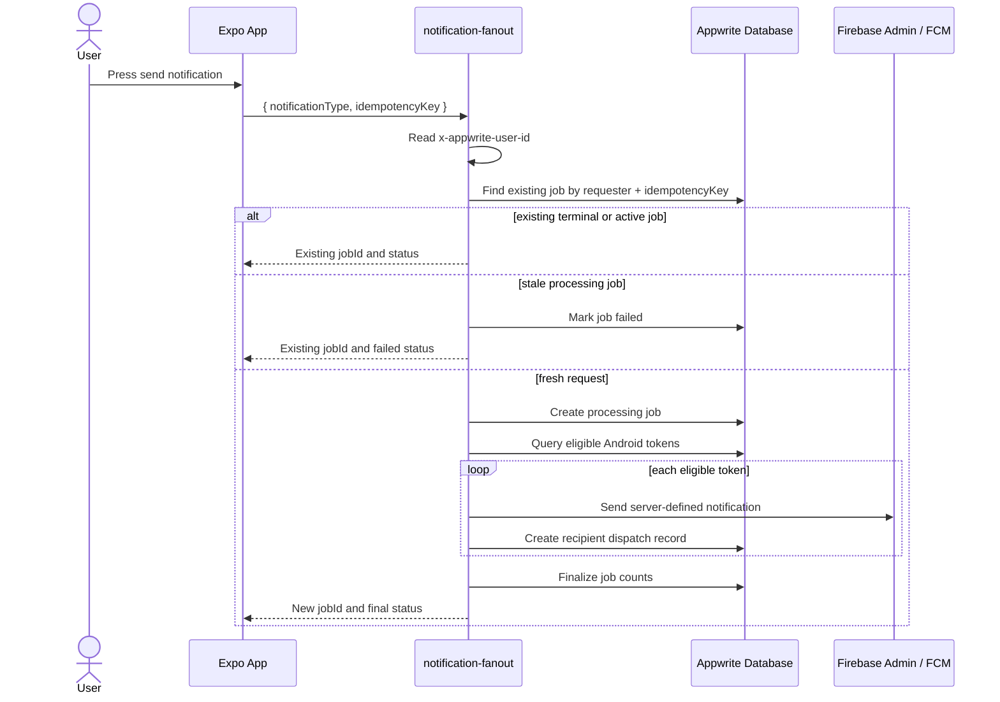
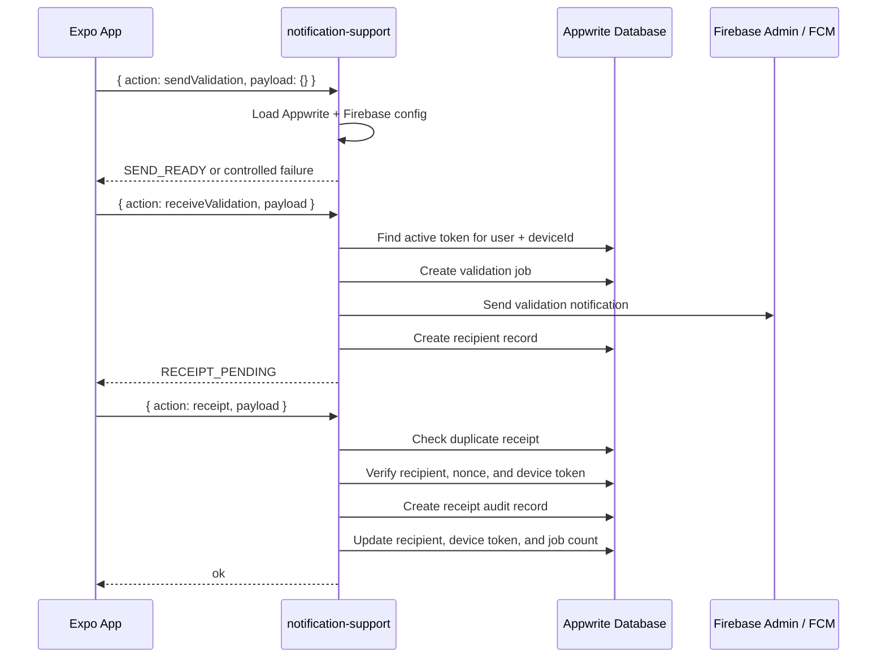

# Backend Spec Sheet
## Appwrite Functions: `notification-fanout` and `notification-support`

> Deployment update (2026-09-11): use the [reviewed guide](../DOCS/Astra/Code-Reviews/Sep_1126_deployment_guide.md) and [database/permission delta](../DOCS/db_struct_notification_deployment.md) for current archive boundaries, support registration/profile actions, transactional receipts, rate-limit schema, and permission migration. The original source-folder build instructions below are historical.

**Document status:** Draft  
**Generated date:** 2026-09-07  
**Target architecture:** Appwrite Free-tier option 2  
**Actual function IDs / folders:** `notification-fanout`, `notification-support`  
**Requested names interpreted as:** `notifications-fanout` -> `notification-fanout`, `notifications-support` -> `notification-support`  
**Workflow note:** `@generate-backend-spec-sheet.md#L1-479` was requested but is not present in `.devin`, `.windsurf`, or the current repo. This spec follows the available backend-sheet example and uses the function source as the source of truth.

---

# Project

name: Push Notification Example Repo  
description: Appwrite + Firebase Cloud Messaging push notification validation and fanout backend  
runtime: Appwrite Functions, Node.js TypeScript  
client: Expo React Native  
push_provider: Firebase Cloud Messaging through Firebase Admin SDK  
function_count_target: 2 deployed notification functions

---

# Function Overview

## Function: notification-fanout

id: notification-fanout  
name: Notification Fanout  
root_directory: `functions/notification-fanout`  
entry_point: `dist/notification-fanout/src/main.js`  
build_command: `npm install && npm run build`  
check_command: `npm run check`  
execute_access: authenticated users  
source_entry: `functions/notification-fanout/src/main.ts`  
package_name: `notification-fanout`

### Purpose

`notification-fanout` is the trusted server-side fanout function. It accepts an authenticated fanout request, creates or reuses a notification job, selects eligible Android device tokens from Appwrite Database, sends the server-defined notification through Firebase Admin, writes one recipient dispatch record per target device, and finalizes job aggregate counts.

### Responsibilities

* Require an authenticated Appwrite user.
* Accept only `notificationType: "system_test"`.
* Require an `idempotencyKey`.
* Reuse an existing job for the same authenticated requester and idempotency key.
* Detect stale `processing` jobs using `NOTIFICATION_JOB_STALE_SECONDS`.
* Mark stale processing jobs as `failed`.
* Create a new `notification_jobs` document for fresh requests.
* Query active Android device tokens with `tokenStatus` of `untested` or `valid`.
* Limit selected token records using `NOTIFICATION_FANOUT_LIMIT`.
* Optionally include or exclude the sender using `NOTIFICATION_INCLUDE_SENDER`.
* Generate a `receiptNonce` for every recipient record.
* Send the notification through Firebase Admin Messaging.
* Write `notification_recipients` records for accepted and rejected provider sends.
* Finalize `notification_jobs` provider aggregate counts.

### Request Contract

```ts
type FanoutRequest = {
  notificationType: 'system_test';
  idempotencyKey: string;
};
```

### Success Response

```ts
type FanoutResponse = {
  jobId: string;
  status: 'processing' | 'completed' | 'partially_completed' | 'failed';
};
```

### Error Responses

```text
401 AUTH_REQUIRED
400 INVALID_FANOUT_REQUEST
500 FUNCTION_UNAVAILABLE
```

### Internal Data Flow



---

## Function: notification-support

id: notification-support  
name: Notification Support  
root_directory: `functions/notification-support`  
entry_point: `dist/notification-support/src/main.js`  
build_command: `npm install && npm run build`  
check_command: `npm run check`  
execute_access: authenticated users  
source_entry: `functions/notification-support/src/main.ts`  
package_name: `notification-support`

### Purpose

`notification-support` consolidates the lower-volume support operations into one Appwrite Function for the Free-tier two-function limit. It routes three actions: send readiness validation, receive validation, and receipt submission.

### Supported Actions

```text
sendValidation
receiveValidation
receipt
```

### Shared Envelope Contract

```ts
type SupportEnvelope = {
  action?: 'sendValidation' | 'receiveValidation' | 'receipt' | string;
  payload?: unknown;
};
```

Unknown actions return:

```text
400 INVALID_SUPPORT_ACTION
```

### Action: sendValidation

handler: `functions/notification-support/src/handlers/sendValidation.ts`

Purpose:

* Confirm the authenticated user can reach the support function.
* Confirm Appwrite server config can be loaded.
* Confirm Firebase Admin Messaging can initialize.

Request:

```ts
{
  action: 'sendValidation',
  payload: {}
}
```

Success response:

```ts
{
  color: 'green',
  code: 'SEND_READY',
  message: string
}
```

Possible failures:

```text
401 AUTH_REQUIRED
500 SERVER_MISCONFIGURED
500 FUNCTION_UNAVAILABLE
```

### Action: receiveValidation

handler: `functions/notification-support/src/handlers/receiveValidation.ts`

Purpose:

* Validate that the authenticated user's Android device has an active Appwrite device-token record.
* Send a validation notification to that exact device through Firebase Admin.
* Create a validation job and recipient record so a later receipt can prove device reception.

Request:

```ts
{
  action: 'receiveValidation',
  payload: {
    deviceId: string,
    idempotencyKey: string
  }
}
```

Success response:

```ts
{
  color: 'yellow',
  code: 'RECEIPT_PENDING',
  message: string,
  jobId: string,
  recipientRecordId: string
}
```

Possible failures:

```text
401 AUTH_REQUIRED
400 INVALID_RECEIVE_VALIDATION_REQUEST
400 DEVICE_RECORD_INACTIVE
400 FCM_TOKEN_INVALID
500 FUNCTION_UNAVAILABLE
```

### Action: receipt

handler: `functions/notification-support/src/handlers/receipt.ts`

Purpose:

* Accept an authenticated receipt from the recipient device.
* Enforce idempotency with `receiptId`.
* Verify recipient ownership.
* Verify job ID, recipient ID, device ID, active token state, and receipt nonce.
* Write a receipt audit record.
* Update recipient, device-token, and job aggregate state.

Request:

```ts
{
  action: 'receipt',
  payload: {
    jobId: string,
    recipientRecordId: string,
    deviceId: string,
    eventType: 'received' | 'displayed' | 'opened',
    clientTimestamp: string,
    idempotencyKey: string,
    receiptNonce?: string
  }
}
```

Success response:

```ts
{
  ok: true,
  duplicate?: boolean
}
```

Possible failures:

```text
401 AUTH_REQUIRED
400 RECEIPT_MALFORMED
403 RECEIPT_UNAUTHORIZED
500 FUNCTION_UNAVAILABLE
```

### Internal Data Flow



---

# Shared Runtime Configuration

Both functions import `loadConfig()` from `functions/_shared/env.ts`.

The loader throws this error when a required variable is missing:

```text
Missing function environment variable: <NAME>
```

`FIREBASE_PRIVATE_KEY` is normalized with escaped newline replacement, so the Appwrite Console value may contain copied `\n` sequences from Firebase service account JSON.

---

# Environment Variables

## Common Required Appwrite Function Variables

Set these in Appwrite Console for both `notification-fanout` and `notification-support`.

| Variable | Required | Secret | Source | Used for |
|---|---:|---:|---|---|
| `APPWRITE_ENDPOINT` | Yes | No | Appwrite Console project endpoint | Initializes the server Appwrite client. |
| `APPWRITE_PROJECT_ID` | Yes | No | Appwrite Console project settings | Selects the Appwrite project. |
| `APPWRITE_API_KEY` | Yes | Yes | Appwrite Console API key | Allows privileged database reads/writes from functions. |
| `APPWRITE_DATABASE_ID` | Yes | No | Appwrite Database ID | Selects the notification database. |
| `APPWRITE_USERS_COLLECTION_ID` | Yes | No | Appwrite Database collection ID | Loaded by shared config; reserved for user collection operations. |
| `APPWRITE_DEVICE_TOKENS_COLLECTION_ID` | Yes | No | Appwrite Database collection ID | Reads and updates registered device-token records. |
| `APPWRITE_NOTIFICATION_JOBS_COLLECTION_ID` | Yes | No | Appwrite Database collection ID | Creates and updates notification job records. |
| `APPWRITE_NOTIFICATION_RECIPIENTS_COLLECTION_ID` | Yes | No | Appwrite Database collection ID | Creates and updates recipient dispatch/receipt records. |
| `APPWRITE_NOTIFICATION_RECEIPTS_COLLECTION_ID` | Yes | No | Appwrite Database collection ID | Writes idempotent receipt audit records. |

## Common Required Firebase Admin Variables

Set these in Appwrite Console for both functions.

| Variable | Required | Secret | Source | Used for |
|---|---:|---:|---|---|
| `FIREBASE_PROJECT_ID` | Yes | No | Firebase Console service account JSON `project_id` | Initializes Firebase Admin. |
| `FIREBASE_CLIENT_EMAIL` | Yes | Yes | Firebase Console service account JSON `client_email` | Identifies the Firebase service account. |
| `FIREBASE_PRIVATE_KEY` | Yes | Yes | Firebase Console service account JSON `private_key` | Signs Firebase Admin requests. |

## Fanout Runtime Variables

Set these in Appwrite Console for `notification-fanout`.

| Variable | Required by code | Default | Recommended value | Used for |
|---|---:|---:|---|---|
| `NOTIFICATION_INCLUDE_SENDER` | No | `true` unless exactly `false` | `false` for most demos, `true` for self-test fanout | Controls whether the requesting user can receive their own fanout notification. |
| `NOTIFICATION_FANOUT_LIMIT` | No | `100` | `100` on Free tier | Caps the number of eligible device-token records processed in one execution. |
| `NOTIFICATION_JOB_STALE_SECONDS` | No | `300` | `300` | Controls when a duplicate request treats an existing `processing` job as stale and marks it failed. |

Important implementation detail:

* These fanout variables are parsed by the shared `loadConfig()` function, so they are technically readable in both functions.
* They are operationally meaningful only for `notification-fanout`.
* `NOTIFICATION_FANOUT_LIMIT` and `NOTIFICATION_JOB_STALE_SECONDS` must be positive integers if set.

## Appwrite Runtime-Provided Variable

| Variable | Required | Source | Used for |
|---|---:|---|---|
| `APPWRITE_FUNCTION_USER_ID` | Fallback only | Appwrite runtime | Used only if request headers do not expose `x-appwrite-user-id`. |

The function auth helper checks:

```text
x-appwrite-user-id
X-Appwrite-User-Id
APPWRITE_FUNCTION_USER_ID
```

---

# Client Environment Variables

These belong in the Expo client `.env` / `.env.example` layer. They are public identifiers, not backend secrets.

| Variable | Required | Secret | Current example value | Used for |
|---|---:|---:|---|---|
| `EXPO_PUBLIC_APPWRITE_ENDPOINT` | Yes | No | `https://cloud.appwrite.io/v1` | Initializes the mobile Appwrite client. |
| `EXPO_PUBLIC_APPWRITE_PROJECT_ID` | Yes | No | empty placeholder | Selects the Appwrite project from the app. |
| `EXPO_PUBLIC_APPWRITE_DATABASE_ID` | Yes | No | `push_notifications` | Selects the client-visible database. |
| `EXPO_PUBLIC_APPWRITE_USERS_COLLECTION_ID` | Yes | No | `users` | User document operations. |
| `EXPO_PUBLIC_APPWRITE_DEVICE_TOKENS_COLLECTION_ID` | Yes | No | `device_tokens` | Device token registration and lookup. |
| `EXPO_PUBLIC_APPWRITE_NOTIFICATION_JOBS_COLLECTION_ID` | Yes | No | `notification_jobs` | Job status reads/subscriptions. |
| `EXPO_PUBLIC_APPWRITE_NOTIFICATION_RECIPIENTS_COLLECTION_ID` | Yes | No | `notification_recipients` | Recipient status reads/subscriptions. |
| `EXPO_PUBLIC_APPWRITE_NOTIFICATION_RECEIPTS_COLLECTION_ID` | Yes | No | `notification_receipts` | Client-side collection reference. |
| `EXPO_PUBLIC_APPWRITE_FANOUT_FUNCTION_ID` | Yes | No | `notification-fanout` | Direct fanout function invocation. |
| `EXPO_PUBLIC_APPWRITE_SUPPORT_FUNCTION_ID` | Yes | No | `notification-support` | Support action router invocation. |

Never put these backend secrets in the Expo client `.env`:

```text
APPWRITE_API_KEY
FIREBASE_CLIENT_EMAIL
FIREBASE_PRIVATE_KEY
```

---

# Database Dependencies

## Database: push_notifications

id: configured by `APPWRITE_DATABASE_ID` / `EXPO_PUBLIC_APPWRITE_DATABASE_ID`  
example_id: `push_notifications`

### Table: users

id: `users` by default  
env_var: `APPWRITE_USERS_COLLECTION_ID`

Known usage:

* Loaded by shared config.
* Client user records are referenced elsewhere in the app.
* The two current functions do not directly call the Appwrite `Users` service or this collection in the inspected source.

### Table: device_tokens

id: `device_tokens` by default  
env_var: `APPWRITE_DEVICE_TOKENS_COLLECTION_ID`

Fields used by functions:

* `$id`
* `userId`
* `deviceId`
* `fcmToken`
* `platform`
* `isActive`
* `tokenStatus`
* `receiveStatus`
* `lastValidatedAt`
* `lastReceivedAt`
* `updatedAt`

Required indexes:

* `userId + deviceId`
* `userId + deviceId + platform`
* `platform + isActive + tokenStatus`

### Table: notification_jobs

id: `notification_jobs` by default  
env_var: `APPWRITE_NOTIFICATION_JOBS_COLLECTION_ID`

Fields used by functions:

* `jobId`
* `idempotencyKey`
* `requestedByUserId`
* `notificationType`
* `title`
* `body`
* `status`
* `targetCount`
* `providerAcceptedCount`
* `providerRejectedCount`
* `confirmedCount`
* `createdAt`
* `completedAt`

Required indexes:

* `idempotencyKey + requestedByUserId`
* `jobId`

### Table: notification_recipients

id: `notification_recipients` by default  
env_var: `APPWRITE_NOTIFICATION_RECIPIENTS_COLLECTION_ID`

Fields used by functions:

* `recipientRecordId`
* `jobId`
* `recipientUserId`
* `deviceTokenId`
* `username`
* `platform`
* `providerMessageId`
* `dispatchStatus`
* `receiptStatus`
* `failureCode`
* `failureMessage`
* `receiptNonce`
* `dispatchedAt`
* `receivedAt`
* `openedAt`

Required indexes:

* `jobId`
* `recipientUserId`
* `recipientRecordId`

### Table: notification_receipts

id: `notification_receipts` by default  
env_var: `APPWRITE_NOTIFICATION_RECEIPTS_COLLECTION_ID`

Fields used by functions:

* `receiptId`
* `jobId`
* `recipientRecordId`
* `recipientUserId`
* `deviceId`
* `eventType`
* `clientTimestamp`
* `serverTimestamp`

Required indexes:

* `receiptId`
* `jobId`
* `recipientRecordId`

---

# Permissions

## Function Execute Access

Both deployed functions should allow execution by authenticated Appwrite users only.

```text
notification-fanout: authenticated users
notification-support: authenticated users
```

## Document Permissions Written By Functions

`notification-fanout` creates job records with:

```text
read: requester user
```

`notification-fanout` creates recipient records with:

```text
read: requester user
read: recipient user
```

`notification-support.receiveValidation` creates validation job and recipient records with:

```text
read: authenticated user
```

Receipt audit documents are created by the support function with the function's server API key. Confirm collection-level permissions do not allow users to forge trusted receipt audit records directly.

---

# Firebase Console Values Needed

From Firebase Console:

1. Open the Firebase project used by the Android app.
2. Confirm the Android app package is:

```text
com.pushnotificationexample.app
```

3. Download `google-services.json` for local Android builds.
4. Create or use a Firebase service account key for server functions.
5. Copy these service account JSON values into Appwrite Function environment variables:

```text
project_id     -> FIREBASE_PROJECT_ID
client_email   -> FIREBASE_CLIENT_EMAIL
private_key    -> FIREBASE_PRIVATE_KEY
```

Do not commit:

```text
google-services.json
service-account.json
FIREBASE_CLIENT_EMAIL
FIREBASE_PRIVATE_KEY
```

---

# Appwrite Console Values Needed

From Appwrite Console:

1. Project endpoint:

```text
APPWRITE_ENDPOINT
EXPO_PUBLIC_APPWRITE_ENDPOINT
```

2. Project ID:

```text
APPWRITE_PROJECT_ID
EXPO_PUBLIC_APPWRITE_PROJECT_ID
```

3. Server API key with permissions for database/document reads and writes. Store it only as:

```text
APPWRITE_API_KEY
```

4. Database and collection IDs:

```text
APPWRITE_DATABASE_ID
APPWRITE_USERS_COLLECTION_ID
APPWRITE_DEVICE_TOKENS_COLLECTION_ID
APPWRITE_NOTIFICATION_JOBS_COLLECTION_ID
APPWRITE_NOTIFICATION_RECIPIENTS_COLLECTION_ID
APPWRITE_NOTIFICATION_RECEIPTS_COLLECTION_ID
```

5. Function IDs:

```text
EXPO_PUBLIC_APPWRITE_FANOUT_FUNCTION_ID=notification-fanout
EXPO_PUBLIC_APPWRITE_SUPPORT_FUNCTION_ID=notification-support
```

---

# Deployment Checklist

## notification-fanout

* [ ] Appwrite Function exists with ID `notification-fanout`.
* [ ] Root directory is `functions/notification-fanout`.
* [ ] Runtime is Node.js TypeScript.
* [ ] Build command is `npm install && npm run build`.
* [ ] Entry point is `dist/notification-fanout/src/main.js`.
* [ ] Execute access is authenticated users.
* [ ] Common Appwrite variables are configured.
* [ ] Firebase Admin variables are configured.
* [ ] `NOTIFICATION_INCLUDE_SENDER` is intentionally set.
* [ ] `NOTIFICATION_FANOUT_LIMIT` is intentionally set or allowed to default to `100`.
* [ ] `NOTIFICATION_JOB_STALE_SECONDS` is intentionally set or allowed to default to `300`.

## notification-support

* [ ] Appwrite Function exists with ID `notification-support`.
* [ ] Root directory is `functions/notification-support`.
* [ ] Runtime is Node.js TypeScript.
* [ ] Build command is `npm install && npm run build`.
* [ ] Entry point is `dist/notification-support/src/main.js`.
* [ ] Execute access is authenticated users.
* [ ] Common Appwrite variables are configured.
* [ ] Firebase Admin variables are configured.
* [ ] Client support calls send `{ action, payload }`.

---

# Local Verification

Run from repo root:

```powershell
npm run typecheck
npx jest --runInBand
npm run functions:check
```

Expected workspace signal:

```text
> notification-fanout@1.0.0 check
> tsc --noEmit

> notification-support@1.0.0 check
> tsc --noEmit
```

If `notification-support` is not listed, verify:

* `functions/notification-support` exists.
* `functions/notification-support/package.json` exists.
* the root `package.json` includes `"workspaces": ["functions/*"]`.

---

# Open Risks And Caveats

* The requested `@generate-backend-spec-sheet.md#L1-479` workflow file was unavailable locally, so exact formatting from that workflow could not be applied.
* The `APPWRITE_API_KEY`, `FIREBASE_CLIENT_EMAIL`, and `FIREBASE_PRIVATE_KEY` values cannot be gathered from source control and must be copied from the account consoles.
* The local `.env.example` intentionally leaves `EXPO_PUBLIC_APPWRITE_PROJECT_ID` empty.
* `notification-support` currently loads the same shared config as fanout, but its README does not list fanout-only optional variables because they are not operationally needed by support actions.
* Appwrite Cloud plan limits can change; confirm current Appwrite limits before final production deployment.

---

# Confidence

confidence: 0.91

The spec is based on inspected source files, function READMEs, shared environment loading code, and current client invocation code. The main caveat is that the exact requested workflow file was not available in the repository.
