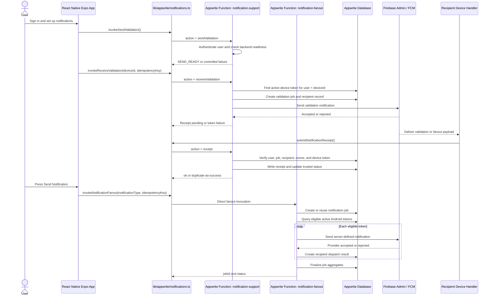

# Product Requirements Document
## Option 2 Appwrite Functions: `notification-fanout` and `notification-support`

**Document status:** Draft  
**Target platform:** React Native Expo mobile app  
**Backend:** Appwrite Cloud Free tier  
**Push provider:** Firebase Cloud Messaging  
**Recommended architecture:** Option 2 from `Project_details/appwrite_free_tier_function_setup_options.md`  
**Version:** 1.0  

---

## 1. Product Summary

This PRD defines the two-function Appwrite backend required for the push notification system while staying within Appwrite Free tier limits.

The deployed functions are:

```text
notification-fanout
notification-support
```

`notification-fanout` remains a dedicated deployed function because it is the central trusted fanout operation. It creates notification jobs, queries eligible Android device tokens, sends notifications through Firebase Admin, creates recipient records, and records provider results.

`notification-support` consolidates the three lower-volume support operations into one deployed function:

```text
sendValidation
receiveValidation
receipt
```

This keeps the project within the Free plan limit of 2 Appwrite Functions per project while preserving the trust boundary required by Firebase Admin credentials, Appwrite API-key privileges, receipt validation, and authoritative delivery state.

## 2. Goals

1. Deploy only two Appwrite Functions for the notification system.
2. Preserve the existing product behavior from `database_defined_push_notification_prd.md`.
3. Keep Firebase Admin credentials and privileged Appwrite writes server-side.
4. Keep fanout behavior isolated from readiness and receipt support behavior.
5. Route support operations by an explicit `action` field.
6. Maintain idempotency for fanout requests and receipt submissions.
7. Keep receive readiness green only after a real device receipt confirms a validation notification.
8. Avoid exposing raw recipient FCM tokens to the client.

## 3. Non-Goals

- Moving authoritative receipt validation into the mobile app.
- Moving receive validation sending into the mobile app.
- Allowing the client to send directly to recipient FCM tokens.
- Creating user-authored notification content.
- Adding group, topic, or campaign notification features.
- Upgrading out of Appwrite Free tier.
- Reworking the database schema beyond fields required by this two-function deployment model.

## 4. Free-Tier Constraint

The architecture is constrained by Appwrite Cloud Free tier limits documented in `appwrite_free_tier_function_setup_options.md`:

- 2 Functions per project.
- 750K executions per month.
- 100 execution logs.
- 15-minute builds.
- 5GB API bandwidth per month.
- Default runtime spec: 512MB memory / 0.5 CPU.
- 100 GB-hours of execution and build time per month.

The two deployed functions must therefore be small, focused, and efficient. Consolidation solves the function-count constraint, but it does not reduce the number of executions when the app still invokes the same number of backend operations.

## 5. System Architecture



## 6. Function Responsibilities

### 6.1 `notification-fanout`

Purpose:

- Handle the authenticated send-notification button flow.
- Create or reuse a `notification_jobs` document by `requestedByUserId + idempotencyKey`.
- Query active eligible Android device-token records.
- Send one server-defined notification to each eligible target through Firebase Admin.
- Create one `notification_recipients` document per target device.
- Store provider accepted/rejected status.
- Mark invalid tokens when FCM returns permanent token failures.
- Finalize job aggregate counts.

This function must not handle receipt writes or readiness validation. Keeping fanout separate makes the highest-risk operation easier to test, observe, and rate limit within the two-function Free tier design.

### 6.2 `notification-support`

Purpose:

- Route support operations through one deployed function slot.
- Validate send readiness.
- Send receive-validation notification to the authenticated user's current device.
- Accept and verify notification receipts.

Supported actions:

```text
sendValidation
receiveValidation
receipt
```

Required internal structure:

```text
functions/notification-support/src/main.ts
functions/notification-support/src/handlers/sendValidation.ts
functions/notification-support/src/handlers/receiveValidation.ts
functions/notification-support/src/handlers/receipt.ts
```

The public Appwrite Function is consolidated, but the code must remain modular so each action can be tested and reviewed independently.

## 7. Client-To-Backend Contract

All calls require an authenticated Appwrite user session.

### 7.1 Fanout Request

Function ID:

```text
notification-fanout
```

Request:

```ts
type InvokeNotificationFanoutRequest = {
  notificationType: 'system_test';
  idempotencyKey: string;
};
```

Response:

```ts
type InvokeNotificationFanoutResponse = {
  jobId: string;
  status: 'processing' | 'completed' | 'partially_completed' | 'failed';
};
```

### 7.2 Support Request Envelope

Function ID:

```text
notification-support
```

Request envelope:

```ts
type NotificationSupportRequest =
  | { action: 'sendValidation'; payload?: Record<string, never> }
  | { action: 'receiveValidation'; payload: ReceiveValidationPayload }
  | { action: 'receipt'; payload: ReceiptPayload };
```

Unknown actions must return:

```text
400 INVALID_SUPPORT_ACTION
```

### 7.3 Send Validation

Request:

```ts
type SendValidationPayload = Record<string, never>;
```

Response:

```ts
type SendValidationResponse = {
  color: 'green' | 'yellow' | 'red';
  code: 'SEND_READY' | 'AUTH_REQUIRED' | 'FUNCTION_UNAVAILABLE' | 'SERVER_MISCONFIGURED';
  message: string;
};
```

Minimum behavior:

- Authenticate the user.
- Confirm required environment values are present.
- Confirm Firebase Admin initialization can be created if send validation is meant to test full backend readiness.
- Return `SEND_READY` only when the backend can support a fanout request.

### 7.4 Receive Validation

Request:

```ts
type ReceiveValidationPayload = {
  deviceId: string;
  idempotencyKey: string;
};
```

Response:

```ts
type ReceiveValidationResponse = {
  color: 'green' | 'yellow' | 'red';
  code:
    | 'RECEIPT_PENDING'
    | 'AUTH_REQUIRED'
    | 'INVALID_RECEIVE_VALIDATION_REQUEST'
    | 'DEVICE_RECORD_INACTIVE'
    | 'FCM_TOKEN_INVALID'
    | 'SERVER_MISCONFIGURED';
  message: string;
  jobId?: string;
  recipientRecordId?: string;
};
```

Minimum behavior:

- Authenticate the user.
- Validate `deviceId` and `idempotencyKey`.
- Find one active Android device-token record for the authenticated user and current device.
- Create a validation notification job.
- Create a recipient record addressed to the same user/device.
- Send a validation notification through Firebase Admin.
- Return yellow `RECEIPT_PENDING` if FCM accepts the send.
- Return red if the device token is missing, inactive, invalid, or rejected.

### 7.5 Receipt

Request:

```ts
type ReceiptPayload = {
  jobId: string;
  recipientRecordId: string;
  deviceId: string;
  eventType: 'received' | 'displayed' | 'opened';
  clientTimestamp: string;
  idempotencyKey: string;
  receiptNonce?: string;
};
```

Response:

```ts
type ReceiptResponse = {
  ok: true;
  duplicate?: boolean;
};
```

Minimum behavior:

- Authenticate the user.
- Reject malformed requests.
- Treat duplicate receipt idempotency keys as success.
- Load the recipient record.
- Verify `recipient.jobId === request.jobId`.
- Verify `recipient.recipientUserId === authenticatedUserId`.
- Verify `receiptNonce` when present.
- Load the referenced device-token record.
- Verify the device token belongs to the authenticated user and `deviceId`.
- Verify the device token is active.
- Create a receipt audit document.
- Update recipient receipt status.
- Update device token `receiveStatus`, `tokenStatus`, and `lastReceivedAt`.
- Increment the job `confirmedCount` without double-counting duplicate receipts.

## 8. Environment Configuration

### 8.1 Client Environment

Replace four public function IDs with two:

```text
EXPO_PUBLIC_APPWRITE_FANOUT_FUNCTION_ID=notification-fanout
EXPO_PUBLIC_APPWRITE_SUPPORT_FUNCTION_ID=notification-support
```

Legacy IDs may temporarily point to the new functions during migration, but the target state is a two-ID client contract.

### 8.2 Server Environment

Both functions need:

```text
APPWRITE_ENDPOINT
APPWRITE_PROJECT_ID
APPWRITE_API_KEY
APPWRITE_DATABASE_ID
APPWRITE_USERS_COLLECTION_ID
APPWRITE_DEVICE_TOKENS_COLLECTION_ID
APPWRITE_NOTIFICATION_JOBS_COLLECTION_ID
APPWRITE_NOTIFICATION_RECIPIENTS_COLLECTION_ID
APPWRITE_NOTIFICATION_RECEIPTS_COLLECTION_ID
```

Functions that send through Firebase Admin need:

```text
FIREBASE_PROJECT_ID
FIREBASE_CLIENT_EMAIL
FIREBASE_PRIVATE_KEY
```

`notification-fanout` also needs:

```text
NOTIFICATION_INCLUDE_SENDER
NOTIFICATION_FANOUT_LIMIT
```

`notification-support` may also need:

```text
NOTIFICATION_VALIDATION_TIMEOUT_SECONDS
NOTIFICATION_RECEIPT_TIMEOUT_SECONDS
```

## 9. Data Requirements

The two-function PRD uses the existing collections:

- `users`
- `device_tokens`
- `notification_jobs`
- `notification_recipients`
- `notification_receipts`

No new collection is required solely for option 2.

Required indexes:

- `device_tokens`: `userId + deviceId`
- `device_tokens`: `platform + isActive + tokenStatus`
- `notification_jobs`: `requestedByUserId + idempotencyKey`
- `notification_receipts`: `receiptId`
- `notification_recipients`: `jobId`
- `notification_recipients`: `recipientUserId`

## 10. Authorization And Security Requirements

1. Both functions require authenticated execution access.
2. Firebase Admin credentials must exist only in Appwrite Functions.
3. The client must never read other users' FCM tokens.
4. `notification-fanout` must use server-defined title/body content.
5. `notification-fanout` must ignore any client-supplied recipient list.
6. `notification-support.receipt` must verify ownership, nonce, and device-token state before trusted writes.
7. All error responses must be sanitized.
8. Logs must never include full FCM tokens, Firebase private keys, or Appwrite API keys.
9. Receipt idempotency must prevent duplicate `confirmedCount` increments.
10. Fanout idempotency must prevent duplicate jobs for repeated button submissions.

## 11. Error Model

Common errors:

```text
AUTH_REQUIRED
AUTH_FORBIDDEN
INVALID_SUPPORT_ACTION
INVALID_FANOUT_REQUEST
INVALID_RECEIVE_VALIDATION_REQUEST
RECEIPT_MALFORMED
RECEIPT_UNAUTHORIZED
RECEIPT_DUPLICATE
DEVICE_RECORD_INACTIVE
FCM_TOKEN_INVALID
FCM_SEND_FAILED
SERVER_MISCONFIGURED
FUNCTION_UNAVAILABLE
UNKNOWN_ERROR
```

HTTP status conventions:

- `200`: success or duplicate-as-success.
- `400`: malformed request or invalid action.
- `401`: missing authenticated user.
- `403`: authenticated but not authorized for the resource.
- `409`: idempotency conflict when the same key is reused with incompatible data.
- `429`: fanout or validation rate limit exceeded.
- `500`: unexpected backend failure.

## 12. Performance Requirements

1. `notification-fanout` must return a `jobId` promptly after creating or finding the job.
2. `notification-fanout` must limit each token query to a bounded page size.
3. `notification-fanout` must not load unbounded token sets into memory.
4. `notification-support.receipt` must perform minimal reads and writes because every delivered notification can produce a receipt execution.
5. Build dependencies must remain small enough for Free tier 15-minute builds.
6. Runtime work must account for the Free tier default 512MB / 0.5 CPU allocation.

## 13. Implementation Checklist

### 13.1 Backend

- [ ] Create `functions/notification-support`.
- [ ] Add routed `main.ts` with exhaustive action handling.
- [ ] Move send-validation logic into `handlers/sendValidation.ts`.
- [ ] Move receive-validation logic into `handlers/receiveValidation.ts`.
- [ ] Move receipt logic into `handlers/receipt.ts`.
- [ ] Keep `notification-fanout` as a separate function.
- [ ] Update function READMEs with Appwrite Console settings.
- [ ] Share common Appwrite/Firebase/env/http helpers from `functions/_shared`.
- [ ] Add action-level unit tests where handler dependencies can be mocked.
- [ ] Verify `npm run functions:check`.

### 13.2 Frontend

- [ ] Replace separate support function IDs with `EXPO_PUBLIC_APPWRITE_SUPPORT_FUNCTION_ID`.
- [ ] Update `lib/config.ts` to expose `fanout` and `support`.
- [ ] Update `lib/appwrite/notifications.ts` so support calls use `{ action, payload }`.
- [ ] Keep fanout calls directed to `notification-fanout`.
- [ ] Preserve receipt retry behavior and duplicate-as-success handling.
- [ ] Preserve readiness color mapping.

### 13.3 Data And Security

- [ ] Confirm document permissions prevent clients from reading raw tokens for other users.
- [ ] Confirm only functions can update provider result counts and trusted receipt state.
- [ ] Confirm receipt nonce is generated server-side and included only in notification data payload.
- [ ] Confirm all function environment variables are configured in Appwrite Console.
- [ ] Confirm no secrets are added to `.env`, `.env.example`, or source control.

### 13.4 Testing

- [ ] Test send validation while authenticated.
- [ ] Test send validation while unauthenticated.
- [ ] Test receive validation with active token.
- [ ] Test receive validation with inactive/missing token.
- [ ] Test fanout with zero eligible recipients.
- [ ] Test fanout with one eligible recipient.
- [ ] Test fanout with mixed accepted/rejected FCM results.
- [ ] Test receipt success.
- [ ] Test duplicate receipt.
- [ ] Test receipt with wrong user.
- [ ] Test receipt with wrong `deviceId`.
- [ ] Test receipt with wrong `receiptNonce`.
- [ ] Test foreground, background, and terminated notification receipt paths on a physical Android device.

## 14. Migration Plan

1. Create `notification-support` as the second deployed function.
2. Copy the existing send-validation, receive-validation, and receipt logic into internal support handlers.
3. Add a support router in `notification-support/src/main.ts`.
4. Update client config to use `EXPO_PUBLIC_APPWRITE_SUPPORT_FUNCTION_ID`.
5. Update support invocations to send `{ action, payload }`.
6. Keep `notification-fanout` deployed as-is unless minor contract cleanup is needed.
7. Deploy both functions to Appwrite.
8. Verify readiness validation, receive validation, fanout, and receipt flows.
9. Remove or stop deploying the old standalone support functions:
   - `notification-send-validation`
   - `notification-receive-validation`
   - `notification-receipt`

## 15. Acceptance Criteria

The option-2 implementation is accepted when:

1. The Appwrite project has only two deployed notification functions.
2. `notification-fanout` handles only fanout requests.
3. `notification-support` handles `sendValidation`, `receiveValidation`, and `receipt`.
4. The app can show send readiness from `notification-support`.
5. The app can send a receive-validation notification through `notification-support`.
6. The receive indicator becomes green only after a verified receipt.
7. The app can invoke fanout through `notification-fanout`.
8. Recipient devices can submit receipts through `notification-support`.
9. Duplicate fanout requests return the existing job.
10. Duplicate receipt submissions return success without double-counting.
11. The client never sends to recipient FCM tokens directly.
12. Firebase Admin credentials are never present in the mobile app.
13. All relevant checks pass:

```bash
npm run typecheck
npm test
npm run functions:check
```

## 16. Assumptions

- The Appwrite Free tier function-count limit remains 2 functions per project for this implementation.
- The project remains Android-first for FCM validation, matching the current function code.
- The existing Appwrite collections are already available or will be created from the existing database PRD/checklist.
- Receipt confirmation is still a required product behavior, not optional telemetry.
- `notification-support` action routing is done through JSON body fields, not separate public URLs.

## 17. Risks And Caveats

- Consolidation reduces deployed function count but not execution count.
- `notification-support` logs will contain mixed action logs, which matters because Free tier has limited execution logs.
- A bug in the support router can affect all three support actions.
- Fanout still needs bounded pagination before this design is safe for large user counts.
- Receipt `confirmedCount` must avoid double-counting when a recipient sends both `received` and `opened`.
- Appwrite database permissions remain security-critical; the function split does not compensate for overly broad document permissions.

## 18. Confidence

Confidence: **0.91**

Reasoning:

- The recommendation directly follows the existing option-2 decision note.
- The current repo already has separate implementations for all four original function responsibilities.
- The new PRD preserves the existing trust boundary while fitting Appwrite Free tier's two-function deployment limit.

Key caveat:

- Appwrite plan limits can change. Reconfirm the pricing page before deployment if this PRD is used later than the current planning cycle.

