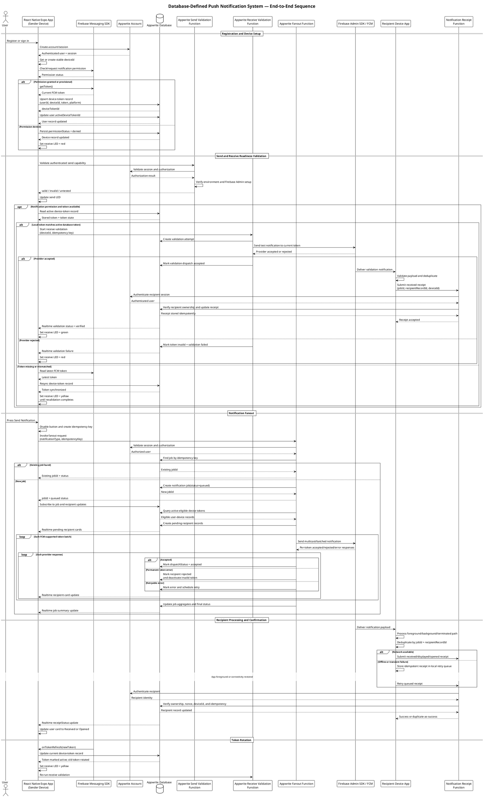
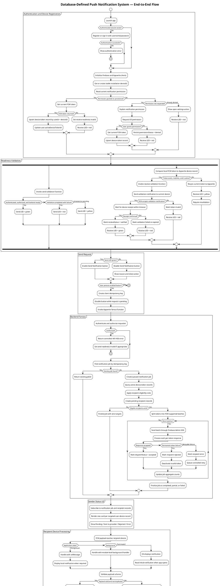

# PlantUML Diagrams — Database-Defined Push Notification System

## Sequence Diagram

```plantuml
@startuml
!theme plain
title Database-Defined Push Notification System — End-to-End Sequence

actor User
participant "React Native Expo App\n(Sender Device)" as SenderApp
participant "Firebase Messaging SDK" as SenderFCM
participant "Appwrite Account" as Account
database "Appwrite Database" as DB
participant "Appwrite Send Validation\nFunction" as SendValidation
participant "Appwrite Receive Validation\nFunction" as ReceiveValidation
participant "Appwrite Fanout Function" as Fanout
participant "Firebase Admin SDK / FCM" as FCM
participant "Recipient Device App" as RecipientApp
participant "Notification Receipt\nFunction" as ReceiptFn

== Registration and Device Setup ==
User -> SenderApp: Register or sign in
SenderApp -> Account: Create account/session
Account --> SenderApp: Authenticated user + session
SenderApp -> SenderApp: Get or create stable deviceId
SenderApp -> SenderFCM: Check/request notification permission
SenderFCM --> SenderApp: Permission status

alt Permission granted or provisional
    SenderApp -> SenderFCM: getToken()
    SenderFCM --> SenderApp: Current FCM token
    SenderApp -> DB: Upsert device-token record\n(userId, deviceId, token, platform)
    DB --> SenderApp: deviceTokenId
    SenderApp -> DB: Update user.activeDeviceTokenId
    DB --> SenderApp: User record updated
else Permission denied
    SenderApp -> DB: Persist permissionStatus = denied
    DB --> SenderApp: Device record updated
    SenderApp -> SenderApp: Set receive LED = red
end

== Send and Receive Readiness Validation ==
SenderApp -> SendValidation: Validate authenticated send capability
SendValidation -> Account: Validate session and authorization
Account --> SendValidation: Authorization result
SendValidation -> SendValidation: Verify environment and Firebase Admin setup
SendValidation --> SenderApp: valid / invalid / untested
SenderApp -> SenderApp: Update send LED

opt Notification permission and token available
    SenderApp -> DB: Read active device-token record
    DB --> SenderApp: Stored token + token state

    alt Local token matches active database token
        SenderApp -> ReceiveValidation: Start receive validation\n(deviceId, idempotency key)
        ReceiveValidation -> DB: Create validation attempt
        ReceiveValidation -> FCM: Send test notification to current token
        FCM --> ReceiveValidation: Provider accepted or rejected

        alt Provider accepted
            ReceiveValidation -> DB: Mark validation dispatch accepted
            FCM -> RecipientApp: Deliver validation notification
            RecipientApp -> RecipientApp: Validate payload and deduplicate
            RecipientApp -> ReceiptFn: Submit received receipt\n(jobId, recipientRecordId, deviceId)
            ReceiptFn -> Account: Authenticate recipient session
            Account --> ReceiptFn: Authenticated user
            ReceiptFn -> DB: Verify recipient ownership and update receipt
            DB --> ReceiptFn: Receipt stored idempotently
            ReceiptFn --> RecipientApp: Receipt accepted
            DB --> SenderApp: Realtime validation status = verified
            SenderApp -> SenderApp: Set receive LED = green
        else Provider rejected
            ReceiveValidation -> DB: Mark token invalid + validation failed
            DB --> SenderApp: Realtime validation failure
            SenderApp -> SenderApp: Set receive LED = red
        end
    else Token missing or mismatched
        SenderApp -> SenderFCM: Read latest FCM token
        SenderFCM --> SenderApp: Latest token
        SenderApp -> DB: Resync device-token record
        DB --> SenderApp: Token synchronized
        SenderApp -> SenderApp: Set receive LED = yellow\nuntil revalidation completes
    end
end

== Notification Fanout ==
User -> SenderApp: Press Send Notification
SenderApp -> SenderApp: Disable button and create idempotency key
SenderApp -> Fanout: Invoke fanout request\n(notificationType, idempotencyKey)
Fanout -> Account: Validate session and authorization
Account --> Fanout: Authorized user
Fanout -> DB: Find job by idempotency key

alt Existing job found
    DB --> Fanout: Existing jobId
    Fanout --> SenderApp: Existing jobId + status
else New job
    Fanout -> DB: Create notification job(status=queued)
    DB --> Fanout: New jobId
    Fanout --> SenderApp: jobId + queued status
    SenderApp -> DB: Subscribe to job and recipient updates

    Fanout -> DB: Query active eligible device tokens
    DB --> Fanout: Eligible user-device records
    Fanout -> DB: Create pending recipient records
    DB --> SenderApp: Realtime pending recipient cards

    loop Each FCM-supported token batch
        Fanout -> FCM: Send multicast/batched notification
        FCM --> Fanout: Per-token accepted/rejected/error responses

        loop Each provider response
            alt Accepted
                Fanout -> DB: Mark dispatchStatus = accepted
            else Permanent token error
                Fanout -> DB: Mark recipient rejected\nand deactivate invalid token
            else Retryable error
                Fanout -> DB: Mark error and schedule retry
            end
            DB --> SenderApp: Realtime recipient-card update
        end
    end

    Fanout -> DB: Update job aggregates and final status
    DB --> SenderApp: Realtime job summary update
end

== Recipient Processing and Confirmation ==
FCM -> RecipientApp: Deliver notification payload
RecipientApp -> RecipientApp: Process foreground/background/terminated path
RecipientApp -> RecipientApp: Deduplicate by jobId + recipientRecordId

alt Network available
    RecipientApp -> ReceiptFn: Submit received/displayed/opened receipt
else Offline or transient failure
    RecipientApp -> RecipientApp: Store idempotent receipt in local retry queue
    ... App foreground or connectivity restored ...
    RecipientApp -> ReceiptFn: Retry queued receipt
end

ReceiptFn -> Account: Authenticate recipient
Account --> ReceiptFn: Recipient identity
ReceiptFn -> DB: Verify ownership, nonce, deviceId, and idempotency
DB --> ReceiptFn: Recipient record updated
ReceiptFn --> RecipientApp: Success or duplicate-as-success
DB --> SenderApp: Realtime receiptStatus update
SenderApp -> SenderApp: Update user card to Received or Opened

== Token Rotation ==
SenderFCM -> SenderApp: onTokenRefresh(newToken)
SenderApp -> DB: Update current device-token record
DB --> SenderApp: Token marked active; old token rotated
SenderApp -> SenderApp: Set receive LED = yellow
SenderApp -> ReceiveValidation: Re-run receive validation

@enduml
```

## End-to-End Flow Diagram

```plantuml
@startuml
!theme plain
title Database-Defined Push Notification System — End-to-End Flow

start

partition "Authentication and Device Registration" {
  :Launch app;
  if (Authenticated session exists?) then (No)
    :Register or sign in with username/password;
    if (Authentication successful?) then (No)
      :Show authentication error;
      stop
    endif
  endif

  :Initialize Firebase and Appwrite clients;
  :Get or create stable installation deviceId;
  :Read current notification permission;

  if (Permission granted or provisional?) then (Yes)
    :Get current FCM token;
    if (FCM token returned?) then (Yes)
      :Upsert device-token record by userId + deviceId;
      :Update user.activeDeviceTokenId;
    else (No)
      :Set receive readiness invalid;
      :Receive LED = red;
    endif
  else (No)
    if (Permission not requested?) then (Yes)
      :Explain notification permission;
      :Request OS permission;
      if (User grants permission?) then (Yes)
        :Get current FCM token;
        :Upsert device-token record;
      else (No)
        :Persist permissionStatus = denied;
        :Receive LED = red;
      endif
    else (Already denied)
      :Show open-settings action;
      :Receive LED = red;
    endif
  endif
}

partition "Readiness Validation" {
  fork
    :Invoke send-validation function;
    if (Authenticated, authorized, and backend ready?) then (Yes)
      :Send LED = green;
    elseif (Validation completed with failure?) then (Yes)
      :Send LED = red;
    else (Untested or pending)
      :Send LED = yellow;
    endif
  fork again
    :Compare local FCM token to Appwrite device record;
    if (Token exists, matches, and is active?) then (Yes)
      :Invoke receive-validation function;
      :Send validation notification to current device;
      if (FCM accepts validation notification?) then (Yes)
        :Wait for device receipt within timeout;
        if (Receipt confirmed?) then (Yes)
          :Mark receiveStatus = verified;
          :Receive LED = green;
        else (No)
          :Mark validation failed or expired;
          :Receive LED = red;
        endif
      else (No)
        :Mark token invalid;
        :Receive LED = red;
      endif
    else (No)
      :Resync current token to Appwrite;
      :Receive LED = yellow;
      :Require revalidation;
    endif
  end fork
}

partition "Send Request" {
  if (Send LED green?) then (Yes)
    :Enable Send Notification button;
  else (No)
    :Disable Send Notification button;
    :Show reason and retest action;
  endif

  if (User presses enabled button?) then (Yes)
    :Create client idempotency key;
    :Disable button while request is pending;
    :Invoke Appwrite fanout function;
  else (No)
    stop
  endif
}

partition "Backend Fanout" {
  :Authenticate and authorize requester;
  if (Authorized?) then (No)
    :Return controlled 401/403 error;
    :Set send readiness invalid if appropriate;
    stop
  endif

  :Find notification job by idempotency key;
  if (Existing job found?) then (Yes)
    :Return existing jobId;
  else (No)
    :Create queued notification job;
    :Query active device-token records;
    :Apply recipient eligibility rules;
    :Create pending recipient records;

    if (Eligible recipients exist?) then (No)
      :Finalize job with zero targets;
    else (Yes)
      :Split tokens into FCM-supported batches;

      while (More batches?) is (Yes)
        :Send batch through Firebase Admin SDK;
        :Process each per-token response;

        if (Response accepted?) then (Yes)
          :Mark dispatchStatus = accepted;
        elseif (Permanent token failure?) then (Yes)
          :Mark recipient rejected;
          :Deactivate invalid token;
        else (Retryable failure)
          :Mark recipient error;
          :Queue controlled retry;
        endif

        :Update job aggregate counts;
      endwhile (No)

      :Finalize job as completed, partial, or failed;
    endif
  endif
}

partition "Sender Status UI" {
  :Subscribe to notification job and recipient records;
  :Render one card per targeted user-device record;
  :Show Pending / Sent to provider / Rejected / Error;
}

partition "Recipient Device Processing" {
  :FCM payload reaches recipient device;
  if (Application state?) then (Foreground)
    :Handle with onMessage;
    :Display local notification when required;
  elseif (Background)
    :Handle with module-level background handler;
  else (Terminated)
    :OS displays notification;
    :Read initial notification when app opens;
  endif

  :Validate payload schema;
  if (Payload valid and not duplicate?) then (Yes)
    :Create idempotent receipt event;
    if (Network available?) then (Yes)
      :Submit receipt function request;
    else (No)
      :Store receipt in local retry queue;
      :Retry on foreground or connectivity recovery;
    endif
  else (No)
    :Ignore duplicate or reject malformed payload;
  endif
}

partition "Receipt Confirmation" {
  :Authenticate recipient session;
  :Verify recipient ownership, deviceId, job, and nonce;
  if (Receipt authorized and valid?) then (Yes)
    :Store receipt idempotently;
    :Set receiptStatus = received/displayed/opened;
    :Update job confirmedCount;
    :Push Realtime update to sender;
    :Sender card shows Received or Opened;
  else (No)
    :Reject unauthorized or malformed receipt;
  endif
}

partition "Lifecycle and Recovery" {
  if (FCM token refresh event occurs?) then (Yes)
    :Update existing device-token record;
    :Mark previous token rotated;
    :Set receive LED = yellow;
    :Run receive validation again;
  endif

  if (Pending receipt retries exist?) then (Yes)
    :Load oldest pending receipt;
    while (Pending receipts remain?) is (Yes)
      :Submit receipt;
      if (Success or duplicate?) then (Yes)
        :Remove receipt from queue;
      elseif (Permanent rejection?) then (Yes)
        :Remove and log terminal failure;
      else (Retryable)
        :Increment retry metadata and retain;
      endif
    endwhile (No)
  endif
}

stop
@enduml
```
